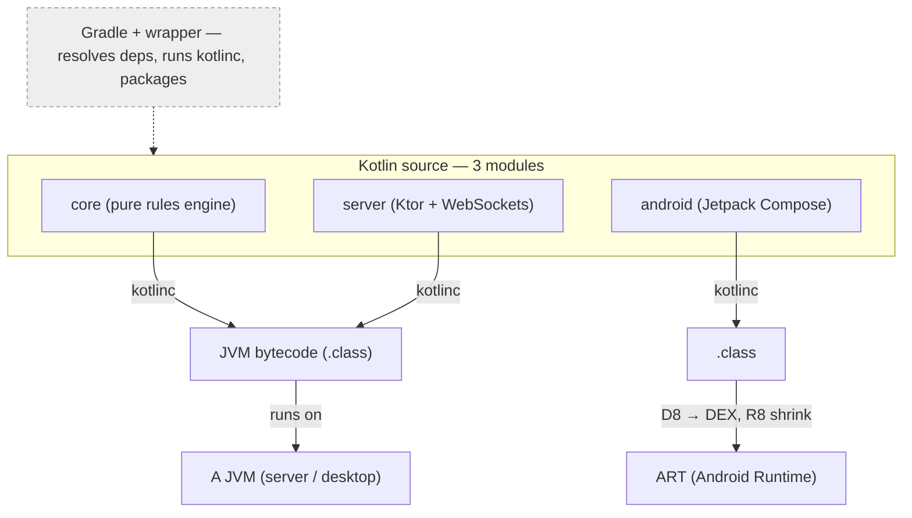

# Kotlin, from the JVM up — a deep-dive course

A rigorous, from-scratch course on **Kotlin and its ecosystem**, written while building a real
project: a multiplayer app with a shared pure-Kotlin **core** module, a **Ktor** WebSocket backend,
and a **Jetpack Compose** Android app.

It's written for an experienced programmer who is *new to Kotlin/JVM* and wants to understand **every
line — from all angles**: not just the syntax, but what each construct compiles to, why the runtime
behaves as it does, and how the build and frameworks fit together.

> **Not another "hello world" tutorial.** Every bytecode listing is real `javap` output; every code
> snippet was executed and its output verified; every concept is grounded in the official JetBrains,
> Ktor, Android, and Gradle documentation and links back to it.

---

## The mental model the whole course builds toward



---

## Course index

Start at **[`kotlin-course/`](kotlin-course/README.md)** and read in order, or jump to a topic.

| # | Chapter | You'll understand |
|---|---------|-------------------|
| 00 | [Fast start & whole-stack map](kotlin-course/README.md) | How the pieces fit; how to run everything |
| 01 | [The JVM & bytecode](kotlin-course/01-jvm-and-bytecode.md) | Bytecode, JVM memory, class loading, JIT, GC, DEX/ART |
| 02 | [Kotlin → bytecode (all angles)](kotlin-course/02-kotlin-to-bytecode.md) | What `data class`, `object`, extensions, default args *become* — with real `javap` output |
| 03 | [Language core & the type system](kotlin-course/03-language-core.md) | Null safety, `Any`/`Unit`/`Nothing`, scope functions, `sealed`, generics & variance |
| 04 | [Functions, lambdas & DSLs](kotlin-course/04-functions-lambdas-dsl.md) | **Lambda-with-receiver** — the idea behind every `{ }` block in Ktor & Compose |
| 05 | [Coroutines & Flow](kotlin-course/05-coroutines-and-flow.md) | Suspension vs blocking, structured concurrency, `Channel`/`Flow`/`StateFlow` |
| 06 | [Gradle & the build ecosystem](kotlin-course/06-gradle-and-ecosystem.md) | Configurations, BOM, version catalogs, the AGP→APK pipeline, Ktor & Compose internals |

> Chapters 07–09 apply all of the above to a real codebase, line by line. They live in a separate
> private repo (they walk my in-progress product code); the six public chapters teach every concept
> they use.

---

## What makes it different

- **Bytecode you can see.** Chapter 02 disassembles a real compiled class to show the `data class`
  machinery, the `object` singleton, the extension-function receiver, and the default-argument
  bitmask — so "Kotlin compiles to bytecode" becomes something you've *looked at*.
- **Verified, not asserted.** Every snippet with a stated result was run through the Kotlin REPL or
  `kotlin` script runner; every bytecode listing came from `javap -c -p`.
- **Diagrams that stick.** Mermaid flow/sequence diagrams (compilation pipeline, coroutine
  suspend/resume, structured concurrency, the APK build, WebSocket lifecycle, Compose data flow) plus
  ASCII layouts for memory and bytecode.
- **Grounded in the source of truth.** Inline links to kotlinlang.org, ktor.io,
  developer.android.com, and docs.gradle.org throughout.

## Try the code as you read

```bash
kotlin                       # REPL — paste snippets, see results
kotlinc file.kt -d out.jar   # compile ahead-of-time
javap -c -p Some.class       # disassemble — see the real bytecode
```

---

## About

Written by **Alexandro Disla** ([GitHub @AD0791](https://github.com/AD0791)) while learning Kotlin by
building a real project. Shared publicly as a learning log and reference — corrections and
questions welcome via issues.

## License

© 2026 Alexandro Disla. The written content of this course is licensed under
**[Creative Commons Attribution 4.0 International (CC BY 4.0)](LICENSE)** — you're free to share and
adapt it, with attribution. Code snippets are provided under the same terms; reuse them freely with
credit.
