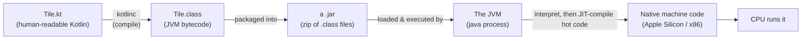
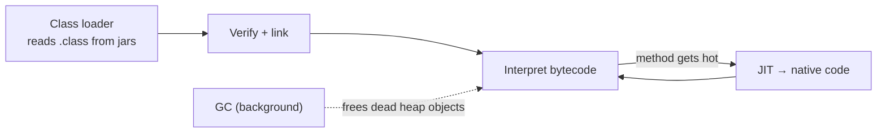
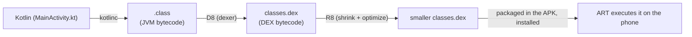

# 01 · The JVM & bytecode

> **Goal:** understand *what actually runs your code*. After this chapter, "Kotlin runs on the JVM"
> stops being a slogan and becomes a concrete picture: source → bytecode → a running virtual machine
> → your CPU, plus the memory and the moving parts inside that machine. We also cover the Android
> twist (DEX/ART), because `app` takes a slightly different last step.

← [Course home](README.md) · next → [02 · Kotlin → bytecode](02-kotlin-to-bytecode.md)

---

## 1. The compilation pipeline

You never run `Tile.kt` directly. A **compiler** (`kotlinc`) translates it into **bytecode** — a
compact instruction set for an imaginary computer — stored in `.class` files. A **JVM** (Java
Virtual Machine, a real program on your Mac) then executes that bytecode, translating it to your
actual CPU's instructions as it goes.



Compare it to what you already know:

| You know | The parallel here |
|----------|-------------------|
| `.ts` → `tsc` → `.js` → Node runs it | `.kt` → `kotlinc` → `.class` → the JVM runs it |
| Node is the runtime for JS | The JVM is the runtime for bytecode |
| V8 JITs hot JS to machine code | The JVM JITs hot bytecode to machine code |

**Why an imaginary machine in the middle?** Because a real CPU only understands its own instructions,
and Apple Silicon, Intel, and a phone all differ. Compile **once** to bytecode, and any machine with
a JVM can run it. That is Java's famous **"write once, run anywhere."** The same `.jar` runs on your
Mac and on a Linux server unchanged.

### See real bytecode (do this once, it demystifies everything)

Bytecode isn't secret. `javap` (ships with the JDK) disassembles it. From `core`:

```bash
cd core && ./gradlew compileKotlin
javap -c -p build/classes/kotlin/main/com/example/core/Tile.class | head
```

You'll see lines like `iload_0`, `bipush 7`, `if_icmpge`, `ireturn`. Each is one bytecode
**instruction** operating on a stack of values. You'll almost never read bytecode day-to-day — but
having seen it, "compiles to bytecode" is now a thing you've *looked at*, not taken on faith. Chapter
02 uses this heavily.

---

## 2. What "the JVM" actually is

The JVM is **a specification** with several **implementations**. The one you installed via SDKMAN is
**Temurin (OpenJDK) 17**:

```bash
java -version
# openjdk version "17.0.15" ... Temurin-17.0.15
```

Three acronyms you'll keep meeting — nested like Russian dolls:

```
┌──────────────────────── JDK (Java Development Kit) ─────────────────────────┐
│  Tools to BUILD: javac, javap, jar, jlink …                                 │
│                                                                             │
│   ┌───────────────────── JRE (Java Runtime Environment) ────────────────┐   │
│   │  Everything to RUN a program: the standard library (java.*, kotlin  │   │
│   │  stdlib ships separately) + …                                       │   │
│   │                                                                     │   │
│   │     ┌──────────────── JVM (Java Virtual Machine) ───────────────┐   │   │
│   │     │  The engine that loads .class files and executes bytecode │   │   │
│   │     └───────────────────────────────────────────────────────────┘   │   │
│   └─────────────────────────────────────────────────────────────────────┘   │
└─────────────────────────────────────────────────────────────────────────────┘
```

- **JVM** — executes bytecode. Just the engine.
- **JRE** — JVM + libraries needed to *run* programs.
- **JDK** — JRE + tools needed to *build* programs (`kotlinc` sits on top of the JDK). **You need a
  JDK to develop**, which you have. All three project repos target **Java 17** (`jvmToolchain(17)` in
  the JVM builds, `JavaVersion.VERSION_17` in Android).

---

## 3. Inside a running JVM: the memory model

When you run `./gradlew run` (the server), the JVM carves your process's memory into regions. This is
the single most useful mental model for understanding performance, stack traces, and `OutOfMemory`
errors.

```
        A JVM PROCESS'S MEMORY
   ┌───────────────────────────────────────────────────────────────┐
   │                                                               │
   │   HEAP  (shared by all threads)                               │
   │   ┌─────────────────────────────────────────────────────┐     │
   │   │  Every OBJECT lives here: Tile(3,6), Strings,        │     │
   │   │  Lists, your game Room… Managed by the GARBAGE       │     │
   │   │  COLLECTOR (GC), which frees what's unreachable.     │     │
   │   │  Split into Young gen (new objects) + Old gen        │     │
   │   │  (survivors). Most objects die young.                │     │
   │   └─────────────────────────────────────────────────────┘     │
   │                                                               │
   │   METASPACE (shared)                                          │
   │   ┌─────────────────────────────────────────────────────┐     │
   │   │  Loaded CLASS definitions: the bytecode + metadata   │     │
   │   │  for Tile, String, your Application, etc.            │     │
   │   └─────────────────────────────────────────────────────┘     │
   │                                                               │
   │   PER-THREAD STACKS  (one stack per thread)                   │
   │   Thread "main"        Thread "worker-1"                      │
   │   ┌───────────────┐    ┌───────────────┐                     │
   │   │ frame: main() │    │ frame: run()  │  ← each method call  │
   │   │ frame: module │    │ frame: …      │    pushes a FRAME:   │
   │   │ frame: routing│    │               │    its locals +      │
   │   └───────────────┘    └───────────────┘    operand stack     │
   │                                                               │
   └───────────────────────────────────────────────────────────────┘
```

Two regions you must distinguish, because it's the key to reading a **stack trace**:

- **The heap** holds **objects** (things created with `Tile(3, 6)`, `listOf(...)`, `"text"`). One
  shared pool. The **garbage collector** automatically reclaims objects nothing points to anymore —
  so you never `free()` memory manually. A whole class of C/C++ bugs simply doesn't exist.
- **A stack** holds the chain of **in-progress method calls** for one thread. Each call pushes a
  **frame** (that method's local variables + a small working area). When a method returns, its frame
  pops. A **stack trace** in an error is literally this stack printed top-to-bottom — the exact path
  of calls that led to the failure.

> **Why this matters for the game:** the server is long-lived and handles many players. Objects you
> create per move (a parsed `PlayMove`, a new game state) land on the heap; the GC cleans them up.
> Keeping per-move allocations reasonable keeps GC pauses small. You don't manage memory, but knowing
> *where things live* explains the profiler later.

---

## 4. Class loading, JIT, GC, threads (the four moving parts)

**Class loading.** The JVM loads a class's bytecode from a `.jar` the first time it's needed
(lazily), verifies it's well-formed, and links it. This is why the *classpath* (the set of jars
Gradle assembled) matters: a missing dependency shows up as `ClassNotFoundException` at load time.

**JIT compilation (Just-In-Time).** The JVM starts by **interpreting** bytecode (simple, a bit slow),
watches which methods run a lot ("hot"), and **compiles those to native machine code** on the fly —
in tiers (C1 quick, then C2 aggressive). Practical effect: a server gets *faster the longer it runs*
as hot paths get optimized. It also means micro-benchmarks must "warm up" first.

**Garbage collection.** A background activity that finds heap objects nothing references and frees
them. Modern collectors (G1, the default on 17) work in small increments to keep pauses short. You'll
only tune this much later, if ever.

**Threads.** The JVM maps its threads to real OS threads. Threads share the heap but each has its own
stack. This is exactly why **shared mutable state needs synchronization** — two threads touching the
same object at once is a data race. (Coroutines, Chapter 05, are how we get concurrency *without*
hand-managing threads — but they still ultimately run *on* threads.)



---

## 5. The Android twist: DEX and ART

`core` and `server` stop at "bytecode → a normal JVM." `app` goes one step
further, because phones don't run a standard JVM — they run **ART** (the Android Runtime), which
executes a *different* format called **DEX** (Dalvik Executable), optimized for mobile (one file for
many classes, lower memory).



So the chain is: **your Kotlin → JVM bytecode (same as everywhere) → D8 converts it to DEX → R8
shrinks it → ART runs it.** The important takeaway: the *language and the first compile step are
identical* to the server. That shared front-end is exactly why one pure-Kotlin `core` can feed
both a server JVM and an Android app — same bytecode origin, two back-ends. We unpack D8/R8 as part
of the build pipeline in [Chapter 06](06-gradle-and-ecosystem.md#the-agp-apk-pipeline).

---

## Recap

- Source `.kt` → **`kotlinc`** → **bytecode `.class`** → a **JVM** interprets it, then **JIT**s hot
  paths to native code. `javap` lets you *see* the bytecode.
- **JDK ⊃ JRE ⊃ JVM.** You build with the JDK (Java 17 here); the JVM runs the result.
- JVM memory = **heap** (objects, GC-managed) + **metaspace** (class definitions) + **per-thread
  stacks** (method-call frames — what a stack trace prints).
- Four moving parts: **class loading, JIT, GC, threads.**
- Android replaces the last step: **.class → DEX (D8) → shrunk by R8 → run by ART.**

**Sources:** [Kotlin: server-side/overview & running](https://kotlinlang.org/docs/server-overview.html),
[Oracle JVM spec (overview)](https://docs.oracle.com/javase/specs/jvms/se17/html/index.html),
[Android: build overview / D8 & R8](https://developer.android.com/build/shrink-code),
[Android runtime (ART)](https://source.android.com/docs/core/runtime).

Next, we make this concrete: **exactly what each Kotlin construct becomes in bytecode**, using real
`javap` output from your `Tile.class`. → [02 · Kotlin → bytecode](02-kotlin-to-bytecode.md)
