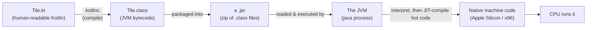
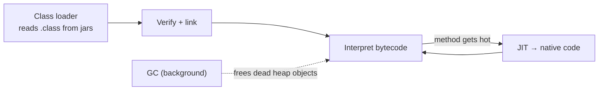

# 01 · The JVM & bytecode

"Kotlin runs on the JVM" is the kind of sentence you can repeat for months without it meaning
anything concrete. This chapter is about making it concrete. By the end, that slogan should unfold
into an actual picture: your source becomes bytecode, a virtual machine loads and runs that bytecode,
and somewhere underneath, your real CPU does the work — with a specific arrangement of memory and a
few moving parts in between. We'll also follow the one place the app diverges from the server, because
Android takes a slightly different last step (DEX and ART).

← [Course home](README.md) · next → [02 · Kotlin → bytecode](02-kotlin-to-bytecode.md)

---

## 1. The compilation pipeline

You never actually run `Tile.kt`. It's text; a CPU has no idea what to do with it. A compiler —
`kotlinc` — translates that text into *bytecode*, a compact instruction set for an imaginary machine,
and stores it in `.class` files. Then a JVM, which is a real program running on your Mac, reads that
bytecode and executes it, translating each instruction into your actual CPU's instructions as it goes.



If that shape feels familiar, it should — it's the same one you already live with in JavaScript. You
write `.ts`, `tsc` compiles it to `.js`, and Node runs the result; here you write `.kt`, `kotlinc`
compiles it to `.class`, and the JVM runs the result. Node is the runtime for JavaScript exactly as
the JVM is the runtime for bytecode. And just as V8 quietly JIT-compiles your hot JavaScript down to
machine code, the JVM does the same for hot bytecode. Different names, same architecture.

The obvious question is why bother with an imaginary machine in the middle at all. The answer is
portability. A real CPU only understands its own instruction set, and Apple Silicon, an Intel chip,
and a phone's processor all differ. Compile once to bytecode, and any machine that has a JVM can run
that same bytecode — this is Java's old promise of "write once, run anywhere," and it's not marketing:
the identical `.jar` you build on your Mac runs unchanged on a Linux server.

It's worth doing this once, because it turns "compiles to bytecode" from a phrase you nod at into a
thing you've actually looked at. Bytecode isn't secret or encrypted; `javap`, which ships with the
JDK, disassembles it into something readable. From `core`:

```bash
cd core && ./gradlew compileKotlin
javap -c -p build/classes/kotlin/main/com/example/core/Tile.class | head
```

You'll see lines like `iload_0`, `bipush 7`, `if_icmpge`, `ireturn` — each one a single instruction
operating on a small stack of values. You will almost never read bytecode in day-to-day work, and
that's fine. The point isn't fluency; it's that after you've seen it once, the whole idea stops being
an article of faith. Chapter 02 leans on this heavily, disassembling real constructs from `Tile`, so
getting comfortable running `javap` now pays off immediately.

---

## 2. What "the JVM" actually is

Here's a distinction that clears up a lot: the JVM is a *specification*, and there are several
*implementations* of it. The one you installed through SDKMAN is Temurin, a build of OpenJDK, at
version 17:

```bash
java -version
# openjdk version "17.0.15" ... Temurin-17.0.15
```

Three acronyms show up constantly — JDK, JRE, JVM — and they're easiest to keep straight as a set of
Russian dolls, each nested inside the last:

```
┌──────────────────────── JDK (Java Development Kit) ─────────────────────────┐
│  Tools to BUILD: javac, javap, jar, jlink …                                 │
│                                                                             │
│   ┌───────────────────── JRE (Java Runtime Environment) ────────────────┐   │
│   │  Everything to RUN a program: the standard library (java.*, kotlin  │   │
│   │  stdlib ships separately) + …                                       │   │
│   │                                                                     │   │
│   │     ┌──────────────── JVM (Java Virtual Machine) ───────────────┐   │   │
│   │     │  The engine that loads .class files and executes bytecode │   │   │
│   │     └───────────────────────────────────────────────────────────┘   │   │
│   └─────────────────────────────────────────────────────────────────────┘   │
└─────────────────────────────────────────────────────────────────────────────┘
```

Working from the inside out: the JVM is just the engine that executes bytecode. Wrap it in the
standard libraries a program needs to run and you have the JRE, the runtime environment. Wrap *that*
in the tools you need to build programs — `javap`, `jar`, and the compilers that `kotlinc` sits on top
of — and you have the JDK. The practical takeaway is that you develop against the JDK, which you have,
and all three project repos target Java 17: you'll see this as `jvmToolchain(17)` in the JVM builds
and `JavaVersion.VERSION_17` on the Android side.

---

## 3. Inside a running JVM: the memory model

The moment you run `./gradlew run` and the server starts, the JVM carves your process's memory into a
few distinct regions. This is the single most useful mental model to carry around, because it quietly
explains three things you'll otherwise meet as mysteries: why performance behaves the way it does, how
to read a stack trace, and what an `OutOfMemory` error is actually telling you.

```
        A JVM PROCESS'S MEMORY
   ┌───────────────────────────────────────────────────────────────┐
   │                                                               │
   │   HEAP  (shared by all threads)                               │
   │   ┌─────────────────────────────────────────────────────┐     │
   │   │  Every OBJECT lives here: Tile(3,6), Strings,        │     │
   │   │  Lists, your game Room… Managed by the GARBAGE       │     │
   │   │  COLLECTOR (GC), which frees what's unreachable.     │     │
   │   │  Split into Young gen (new objects) + Old gen        │     │
   │   │  (survivors). Most objects die young.                │     │
   │   └─────────────────────────────────────────────────────┘     │
   │                                                               │
   │   METASPACE (shared)                                          │
   │   ┌─────────────────────────────────────────────────────┐     │
   │   │  Loaded CLASS definitions: the bytecode + metadata   │     │
   │   │  for Tile, String, your Application, etc.            │     │
   │   └─────────────────────────────────────────────────────┘     │
   │                                                               │
   │   PER-THREAD STACKS  (one stack per thread)                   │
   │   Thread "main"        Thread "worker-1"                      │
   │   ┌───────────────┐    ┌───────────────┐                     │
   │   │ frame: main() │    │ frame: run()  │  ← each method call  │
   │   │ frame: module │    │ frame: …      │    pushes a FRAME:   │
   │   │ frame: routing│    │               │    its locals +      │
   │   └───────────────┘    └───────────────┘    operand stack     │
   │                                                               │
   └───────────────────────────────────────────────────────────────┘
```

Of these regions, two are worth genuinely internalizing, because the difference between them is the
key to reading almost any error. The *heap* is one shared pool where every object lives — everything
you create with `Tile(3, 6)`, `listOf(...)`, or a string literal. You never free any of it by hand;
the garbage collector automatically reclaims objects that nothing points to anymore. That single fact
is why an entire category of C and C++ bugs — dangling pointers, double frees, manual memory
management — simply doesn't exist here.

A *stack*, by contrast, belongs to one thread and holds the chain of method calls currently in
progress. Every call pushes a *frame*, which is that method's local variables plus a little working
area, and when the method returns its frame pops off again. When you read a stack trace in an error,
you are reading exactly this stack printed from top to bottom: the precise sequence of calls that led
to the failure, most recent first. Once you see a stack trace as "the call stack, dumped," it stops
being intimidating and becomes a map.

This isn't abstract for the game. The server is long-lived and juggles many players, and every move
creates short-lived objects — a parsed move, a freshly computed game state — that land on the heap and
get cleaned up by the GC shortly after. You don't manage that memory, but knowing *where* things live
is what makes the profiler legible later: keeping per-move allocations modest is what keeps GC pauses
small, and "modest allocations, small pauses" is a sentence that only means something once you can
picture the heap.

---

## 4. Class loading, JIT, GC, threads (the four moving parts)

With the memory laid out, four mechanisms do the actual work of running your program, and they're
worth meeting by name.

The first is *class loading*. The JVM doesn't read every class up front; it loads a class's bytecode
from a `.jar` the first time that class is needed, verifies the bytecode is well-formed, and links it
in. This laziness is why the *classpath* — the set of jars Gradle assembled for you — matters so much:
a dependency that's missing from it doesn't fail at build time but surfaces later as a
`ClassNotFoundException` the moment something tries to load the absent class.

The second is *JIT compilation*, "just in time." The JVM starts out interpreting bytecode, which is
simple but a little slow. While it interprets, it watches which methods run often — the "hot" ones —
and compiles those down to native machine code on the fly, in tiers (a quick C1 pass first, then a
more aggressive C2 pass for the hottest code). The practical consequence is genuinely useful to know:
a server tends to get *faster the longer it runs* as its hot paths get optimized, which is also why
any honest micro-benchmark has to "warm up" before it measures anything.

The third is *garbage collection*, which we've already met from the heap's side. It's a background
activity that finds objects nothing references and frees them. The modern collectors — G1 is the
default on Java 17 — work in small increments specifically to keep pauses short. It's the kind of thing
you might tune much later, if ever; for now it's enough to know it's running and why.

The fourth is *threads*. The JVM maps its threads onto real operating-system threads. They all share
the one heap, but each has its own stack — and that sharing is precisely why shared mutable state needs
synchronization: two threads touching the same object at the same time is a data race. This is the
problem coroutines exist to tame. Chapter 05 is entirely about getting concurrency without hand-managing
threads, but it's worth saying now that coroutines don't replace threads, they run *on* them.



---

## 5. The Android twist: DEX and ART

Everything so far ends at "bytecode runs on a normal JVM," and for `core` and `server` that's the
whole story. The `app` takes one extra step, because phones don't run a standard JVM. They run ART,
the Android Runtime, and ART executes a different format called DEX (Dalvik Executable) that's tuned
for mobile — one file packing many classes, with a lower memory footprint.


So the full chain for the app is: your Kotlin becomes JVM bytecode exactly as it does everywhere else,
then D8 converts that bytecode into DEX, R8 shrinks it, and ART runs the result on the phone. The
detail that matters — and the reason this is a "twist" rather than a separate world — is that the
language and the *first* compile step are identical to the server's. That shared front end is exactly
what lets one pure-Kotlin `core` feed both a server JVM and an Android app: same bytecode origin, two
different back ends bolted on at the end. We'll open up D8 and R8 as part of the build pipeline in
[Chapter 06](06-gradle-and-ecosystem.md#5-the-agp--apk-pipeline).

---

Step back and the whole path is now a single line you can trace: `.kt` source goes through `kotlinc`
to become bytecode in `.class` files, a JVM interprets that bytecode and JIT-compiles the hot parts to
native code, and `javap` lets you look at any step of it. The JDK contains the JRE contains the JVM;
you build with the outer doll and run on the inner one. Inside a running JVM, memory splits into the
heap (objects, swept by the GC), metaspace (class definitions), and a stack per thread (the call
frames a stack trace prints). Class loading, JIT, GC, and threads are the four parts keeping it all
moving. And Android simply appends two steps — D8 to DEX, R8 to shrink — before ART takes over.

Next we make all of this concrete in the other direction: instead of "what runs bytecode," we look at
*what each Kotlin construct becomes* as bytecode, using real `javap` output from your own `Tile.class`.
→ [02 · Kotlin → bytecode](02-kotlin-to-bytecode.md)

*Further reading: [Kotlin server-side overview](https://kotlinlang.org/docs/server-overview.html), the
[Oracle JVM specification](https://docs.oracle.com/javase/specs/jvms/se17/html/index.html),
[Android's build and shrink docs](https://developer.android.com/build/shrink-code), and the
[ART overview](https://source.android.com/docs/core/runtime).*
