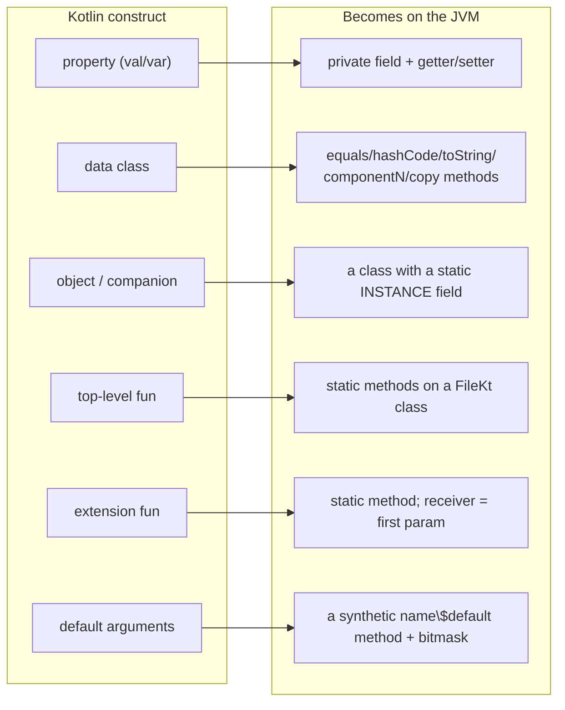

# 02 · Kotlin → bytecode (all angles)

Kotlin's nicest features — `data class`, `object`, extension functions, default arguments — can feel
like the language is doing something the JVM can't. It isn't. Every one of them is *sugar*: syntax the
compiler expands into perfectly ordinary JVM constructs before anything runs. This chapter takes the
conveniences you'll use most and shows you the expansion, so that instead of trusting that `data class`
"gives you equals," you've seen the generated `equals` sitting in the class file. Once you can predict
what a construct becomes, you can also predict how it behaves, how Java code sees it, and roughly what
it costs.

Every listing below is real `javap` output from compiled project code, not an illustration — you can
reproduce any of it with the commands shown. `javap` is the JDK's disassembler; `-p` shows private
members and `-c` shows the actual bytecode instructions.

← [01 · JVM & bytecode](01-jvm-and-bytecode.md) · next → [03 · Language core](03-language-core.md)

---

## The big picture: Kotlin has no "extra" runtime concepts

The JVM's vocabulary is small. It knows classes, fields, methods, and static members, and essentially
nothing else. So whatever Kotlin offers on top of that has to bottom out in those four things — there's
nowhere else for it to go. The map below is what the rest of the chapter proves, construct by
construct: each Kotlin idea on the left is really the JVM shape on the right, wearing nicer syntax.



We'll work through these roughly in order of how surprising the expansion is, starting with the one
that quietly underlies all the others.

---

## 1. Properties are not fields — they're a field + accessors

Coming from most languages, `val low` looks like a field. On the JVM it's actually a pair: a private
field plus getter (and, for `var`, setter) methods. Here's the real `Tile`:

```bash
javap -p core/build/classes/kotlin/main/com/example/core/Tile.class
```
```java
public final class com.example.core.Tile {
  private final int low;                 // the backing FIELD (private)
  private final int high;
  public final int getLow();             // val low  → a getter, no setter
  public final int getHigh();
  public final boolean isDouble();       // val isDouble (computed) → getter named isDouble()
  public final int getTotal();        // val total (computed) → getTotal()
  ...
}
```

That short listing quietly explains several Kotlin behaviors at once, so it's worth reading slowly.
`val low` became a private final field named `low` plus a public `getLow()`, and no setter — because
it's read-only; had it been a `var`, you'd also see `setLow(int)`. The computed properties are the
more interesting case: `val isDouble get() = low == high` produced *only* an `isDouble()` method and no
`isDouble` field at all. It's a method that recomputes its answer on every call, and the same goes for
`total`. Notice too that the boolean kept its name — `isDouble` compiled to `isDouble()`, not
`getIsDouble()` — which is a Kotlin convention for `is`-prefixed booleans that also happens to make the
Java-side call read naturally.

The last observation is the one that ties it together. When Java code uses your `Tile`, it calls
`tile.getLow()` and `tile.isDouble()` explicitly. When Kotlin uses it, you write `tile.low` and the
compiler calls the getter for you behind the scenes. "Property access syntax" is a method call in
disguise — which is exactly why a `val` can run real work inside a custom getter without looking like
it's doing anything.

---

## 2. `data class` = a class the compiler fills in for you

`data class Tile(val low: Int, val high: Int)` is a single line of source. The compiler turned it into
a full class:

```java
public final class com.example.core.Tile {
  public com.example.core.Tile(int, int);        // primary constructor
  public final int component1();      // ← enables destructuring: val (a, b) = tile
  public final int component2();
  public final Tile copy(int, int);   // ← copy(low = .., high = ..)
  public static Tile copy$default(Tile, int, int, int, java.lang.Object);  // copy() with defaults
  public int hashCode();              // ← content-based
  public boolean equals(java.lang.Object);   // ← content-based (==)
  public java.lang.String toString(); // ← "Tile(low=.., high=..)" — but you OVERRODE this
  public static final Tile$Companion Companion;   // ← your companion object (section 4)
}
```

That one `data` keyword bought a lot. It generated `equals` and `hashCode` — which is why
`Tile(3,6) == Tile(3,6)` is true and why tiles work correctly as `Map` or `Set` keys — along with
`toString`, a `copy` for making a changed version of an immutable value, and `component1`/`component2`
for destructuring. In Java you'd hand-write roughly forty lines to get the same thing and then spend
the rest of the project keeping them in sync every time you add a field.

One subtlety the listing shows: your `Tile` overrides `toString()` to print `[high|low]`, so the
generated `toString` isn't there — the compiler only fills in what you didn't write yourself. And the
generated `equals`, which compares `low` and `high` by value, is precisely what lets `TileTest` assert
`assertEquals(Tile.of(6,3), Tile.of(3,6))` and have it pass. The test is really testing that
value-equality the `data` keyword handed you.

---

## 3. Default arguments = one real method + a synthetic `$default` with a bitmask

`fun greet(host: String = "localhost", port: Int = 8080)` is trivial to write, but the JVM has no
concept of a default parameter — a method has a fixed arity, and that's that. So the compiler emits
*two* methods: the real one, and a helper.

```java
public static final java.lang.String greet(java.lang.String, int);            // the real one
public static java.lang.String greet$default(java.lang.String, int, int, java.lang.Object); // helper
```

The helper takes an extra `int`, and that `int` is a *bitmask* recording which arguments the caller
left out. Here's its actual bytecode, from `javap -c`:

```
greet$default(String, int, int mask, Object):
   0: iload_2          // load the mask
   1: iconst_1
   2: iand             // mask & 1  → was arg0 (host) omitted?
   3: ifeq  9
   6: ldc  "localhost" // yes → substitute the default
   8: astore_0
   9: iload_2
  10: iconst_2
  11: iand             // mask & 2  → was arg1 (port) omitted?
  12: ifeq  19
  15: sipush 8080      // yes → substitute the default
  18: istore_1
  19: aload_0
  20: iload_1
  21: invokestatic greet  // finally call the real greet(host, port)
```

Follow the logic and it's just bit-testing: `greet(port = 9090)` compiles to a call to `greet$default`
with a mask that means "host was omitted," and the helper substitutes `"localhost"` before delegating
to the real `greet`. Two things follow from this. Default arguments are free at the call site and
cheap at runtime, a couple of `iand`s and branches. And adding a defaulted parameter to an existing
function stays *binary-compatible* — old callers still link against the same real method — which is why
you can evolve an API this way without breaking its consumers. You'll notice `copy$default` on every
`data class` for exactly the same reason.

---

## 4. `object` and `companion object` = singletons via a static `INSTANCE`

An `object` is Kotlin's built-in singleton: exactly one instance, guaranteed. Compile `object Config`
and you get the textbook thread-safe singleton, generated for you:

```java
public final class demo.Config {
  public static final demo.Config INSTANCE;   // the one and only instance
  private static final java.lang.String version;
  private demo.Config();                       // private ctor: nobody else can make one
  public final java.lang.String getVersion();
  static {};                                   // static initializer creates INSTANCE
}
```

The pieces are the classic pattern: a private constructor so nothing outside can create another one, a
`public static final INSTANCE` field holding the single instance, and a static initializer (`static {}`)
that creates it once, when the class is first loaded. So when you write `Config.version` in Kotlin,
it compiles down to `Config.INSTANCE.getVersion()`.

A `companion object` is the same mechanism, but attached to a class rather than standing alone, which
is how Kotlin gives you Java-`static`-like members without a `static` keyword. That's the
`public static final Tile$Companion Companion;` field you saw hanging off `Tile` in section 2. Writing
`Tile.of(6,3)` compiles to `Tile.Companion.of(6, 3)`: the factory functions `of` and `allPairs` live
once on the companion singleton, not duplicated on every tile you create.

---

## 5. Top-level functions = static methods on a `<File>Kt` class

The JVM has no free-floating functions — every method has to live inside some class. Kotlin lets you
write functions at the top level of a file anyway, and resolves the mismatch by inventing a class named
after the file to hold them. Everything declared at the top level of `Demo.kt` lands here:

```java
public final class demo.DemoKt {                       // ← "<FileName>Kt" facade class
  public static final int MAX_PLAYERS;                 // const val → a static final field
  public static final String topLevel(String);         // top-level fun → static method
  public static final String greet(String, int);
  public static String greet$default(String, int, int, Object);
  public static final boolean isPip(int);              // extension fun (section 6)
  public static final String describe(Object);         // the `when` fun (section 7)
}
```

This is the detail that finally explains a line you've probably stared at. The server's `fun main()`
lives in `Application.kt`, so it compiles into a facade class called `ApplicationKt` — and that's why
the server's build script says `mainClass.set("com.example.server.ApplicationKt")`. The `Kt` suffix
isn't a mystery or a convention someone chose; it's the name the compiler synthesizes from the file,
and now the Gradle line naming it reads as obvious.

---

## 6. Extension functions = static methods; the receiver becomes the first parameter

`fun Int.isPip(): Boolean = this in 0..6` looks as though you reached into `Int` and added a method to
it. You didn't, and you couldn't — `Int` isn't yours to modify. What the compiler actually does is make
an ordinary static function that takes the receiver as its first argument:

```java
public static final boolean isPip(int);   // the Int receiver is just parameter #0
```

The bytecode confirms it. The receiver arrives in local slot 0 (`iload_0`), and `this in 0..6` compiled
to two plain integer comparisons with no `Range` object allocated at all, because the compiler could
see it wasn't needed:

```
isPip(int):
   0: iconst_0
   1: iload_0          // load the receiver (the Int you called .isPip() on)
   2: if_icmpgt 19     // if 0 > receiver → false
   5: iload_0
   6: bipush 7
   8: if_icmpge 15     // if receiver >= 7 → false
  11: iconst_1         // else true
  ...
```

So `6.isPip()` is really `DemoKt.isPip(6)`, a static call. A few consequences fall out of that once and
for all: extensions are resolved *statically*, by the variable's declared type, so there's no virtual
dispatch and no overriding to worry about; they can't touch private members of the receiver, since
they're just outside functions; and they cost nothing beyond a normal call. This same "receiver as a
hidden first parameter" trick is the exact mechanism behind `fun Application.module()` in the server —
`module` is a static function whose first argument is the `Application`, and inside it `this` *is* that
application. [Chapter 04](04-functions-lambdas-dsl.md) shows how the same trick, applied to lambdas,
powers every `{ }` DSL block in Ktor and Compose.

---

## 7. `when` = efficient branching (often a `tableswitch`)

`when` compiles to the most efficient branch the compiler can prove is correct. For a handful of
arbitrary conditions that's a chain of comparisons; for dense integer or enum cases it's a JVM
`tableswitch` or `lookupswitch`, a genuine jump table with O(1) dispatch. The type-checking form is
the one worth watching: `when (x) { is String -> … }` compiles to an `instanceof` check followed by a
checked cast that the compiler inserts for you. That inserted cast is all a *smart cast* is — once
`is String` has been established, the compiler knows the type and casts silently, so you go on using
`x` as a `String` with no ceremony and no explicit cast of your own.

---

## 8. `suspend` (preview) = an extra `Continuation` parameter + a state machine

This one gets a full chapter of its own in [Chapter 05](05-coroutines-and-flow.md), but it belongs on
the map so the picture is complete. A `suspend fun` compiles to a normal method with one extra hidden
parameter — a `Continuation` — and a body rewritten into a *state machine* that can pause at each
suspension point and be resumed later. That's the whole secret behind "waits without blocking a
thread": there's no magic thread being parked somewhere, just a method that's able to return early and
be called again to pick up where it left off. At the bytecode level it's still ordinary methods and
fields; all the cleverness lives in how the compiler rewrote the body.

---

It's worth collecting the expansions in one place, because the pattern across them is the real lesson:
there's always an ordinary JVM shape underneath, and knowing it is what "reading Kotlin from all
angles" actually means.

| You write | Compiler emits | So at runtime it's… |
|-----------|----------------|---------------------|
| `val x` / `var x` | private field + `getX()` (+`setX()`) | a method call behind property syntax |
| computed `val`  `get() =` | just a getter, no field | recomputed each access |
| `data class` | `equals`/`hashCode`/`toString`/`componentN`/`copy` | value semantics for free |
| default args | real method + `name$default(..., mask)` | omitted args filled via a bitmask |
| `object` | class with `static INSTANCE` + private ctor | a lazily-created singleton |
| `companion object` | nested `Companion` singleton, referenced by a static field | Kotlin's "statics" |
| top-level `fun`/`const` | `static` members on `<File>Kt` | why `ApplicationKt` is the main class |
| extension `fun` | `static` method, receiver = param 0 | statically dispatched, zero-cost |
| `when` | comparison chain or `tableswitch` + inserted casts | smart casts are compiler-inserted casts |
| `suspend fun` | method + hidden `Continuation` + state machine | pause/resume without blocking |

With that table in hand you can open almost any `.kt` file and, construct by construct, picture the
JVM shape underneath it. Next we climb back up to the language itself and work through its type system
in depth — the part that, more than any other, is genuinely different from JS, Python, and Java.
→ [03 · Language core & the type system](03-language-core.md)

*Further reading: [calling Kotlin from Java](https://kotlinlang.org/docs/java-to-kotlin-interop.html)
(which documents the `Kt` facades, `$default` helpers, `INSTANCE` fields, and property accessors),
[data classes](https://kotlinlang.org/docs/data-classes.html),
[object declarations](https://kotlinlang.org/docs/object-declarations.html), and
[extensions](https://kotlinlang.org/docs/extensions.html). Reproduce any listing above with `javap -c -p`.*
