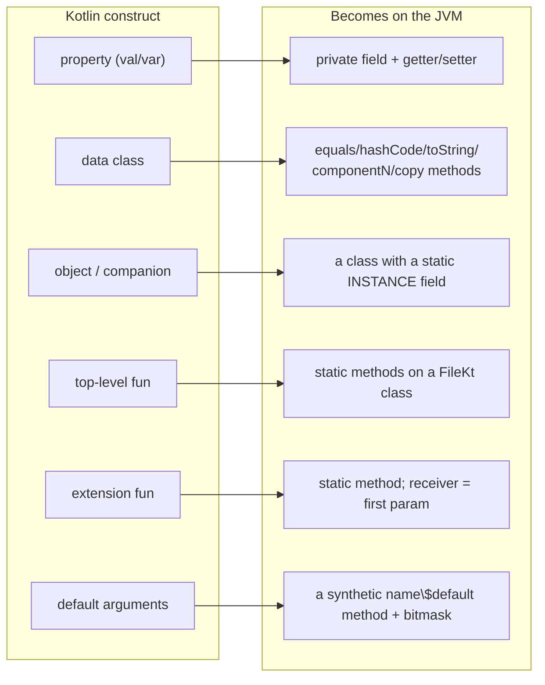

# 02 · Kotlin → bytecode (all angles)

> **Goal:** see *exactly* what your Kotlin turns into. Kotlin's convenient syntax (`data class`,
> `object`, extension functions, default arguments) is **sugar** the compiler expands into ordinary
> JVM constructs. Once you've seen the expansion, nothing in the codebase is magic — and you can
> predict how any Kotlin will behave, interoperate with Java, and perform.

Every listing below is **real `javap` output** from compiled project code. Reproduce any of it
yourself with the commands shown. `javap` = the JDK's disassembler; `-p` shows private members,
`-c` shows the bytecode instructions.

← [01 · JVM & bytecode](01-jvm-and-bytecode.md) · next → [03 · Language core](03-language-core.md)

---

## The big picture: Kotlin has no "extra" runtime concepts

The JVM only knows **classes, fields, methods, and static members**. So *everything* Kotlin offers
must compile down to those. Here's the map this chapter proves, construct by construct:



---

## 1. Properties are not fields — they're a field + accessors

Kotlin `val`/`var` **properties** look like fields but compile to a **private field plus
getter/setter methods**. From your real `Tile`:

```bash
javap -p core/build/classes/kotlin/main/com/example/core/Tile.class
```
```java
public final class com.example.core.Tile {
  private final int low;                 // the backing FIELD (private)
  private final int high;
  public final int getLow();             // val low  → a getter, no setter
  public final int getHigh();
  public final boolean isDouble();       // val isDouble (computed) → getter named isDouble()
  public final int getTotal();        // val total (computed) → getTotal()
  ...
}
```

Read that carefully — it explains several Kotlin behaviors at once:

- `val low` → a **private final field** `low` + a public **`getLow()`**. No setter (it's read-only).
  A `var` would add `setLow(int)`.
- **Computed properties have no field.** `val isDouble get() = low == high` produced *only*
  `isDouble()` — no `isDouble` field. It's a method that recomputes each call. Same for `total`.
- **`is`-prefixed boolean properties** keep the name: `isDouble` → `isDouble()` (not `getIsDouble()`).
  A Kotlin convention that also makes Java interop read naturally.
- When Java code uses your `Tile`, it calls `tile.getLow()` / `tile.isDouble()`. When Kotlin uses it,
  you write `tile.low` and the compiler *calls the getter for you*. "Property access syntax" is just
  a method call in disguise — which is why a `val` can do work in a custom getter.

---

## 2. `data class` = a class the compiler fills in for you

`data class Tile(val low: Int, val high: Int)` is one line. The compiler generated a full class:

```java
public final class com.example.core.Tile {
  public com.example.core.Tile(int, int);        // primary constructor
  public final int component1();      // ← enables destructuring: val (a, b) = tile
  public final int component2();
  public final Tile copy(int, int);   // ← copy(low = .., high = ..)
  public static Tile copy$default(Tile, int, int, int, java.lang.Object);  // copy() with defaults
  public int hashCode();              // ← content-based
  public boolean equals(java.lang.Object);   // ← content-based (==)
  public java.lang.String toString(); // ← "Tile(low=.., high=..)" — but you OVERRODE this
  public static final Tile$Companion Companion;   // ← your companion object (section 4)
}
```

That single `data` keyword bought you: **`equals`/`hashCode`** (so `Tile(3,6) == Tile(3,6)` is true
and tiles work as `Map`/`Set` keys), **`toString`**, **`copy`** (immutable "change one field"), and
**`component1/2`** (destructuring). In Java you'd hand-write ~40 lines and keep them in sync forever.

> **Note:** your `Tile` *overrides* `toString()` to print `[high|low]`, so the generated one is
> replaced — the compiler only generates what you didn't write. This is exactly why `TileTest` can do
> `assertEquals(Tile.of(6,3), Tile.of(3,6))`: the generated `equals` compares `low`/`high` by value.

---

## 3. Default arguments = one real method + a synthetic `$default` with a bitmask

Kotlin lets you write `fun greet(host: String = "localhost", port: Int = 8080)`. The JVM has **no**
concept of default parameters. So the compiler emits **two** methods. Compiled from a sample:

```java
public static final java.lang.String greet(java.lang.String, int);            // the real one
public static java.lang.String greet$default(java.lang.String, int, int, java.lang.Object); // helper
```

The helper takes an **extra `int`** — a **bitmask** saying which arguments the caller *omitted*.
Here's its actual bytecode (from `javap -c`):

```
greet$default(String, int, int mask, Object):
   0: iload_2          // load the mask
   1: iconst_1
   2: iand             // mask & 1  → was arg0 (host) omitted?
   3: ifeq  9
   6: ldc  "localhost" // yes → substitute the default
   8: astore_0
   9: iload_2
  10: iconst_2
  11: iand             // mask & 2  → was arg1 (port) omitted?
  12: ifeq  19
  15: sipush 8080      // yes → substitute the default
  18: istore_1
  19: aload_0
  20: iload_1
  21: invokestatic greet  // finally call the real greet(host, port)
```

So `greet(port = 9090)` compiles to a call to `greet$default` with a mask meaning "host was omitted,"
and the helper fills in `"localhost"`. **Takeaway:** default arguments are free at the call site and
cheap at runtime — and this is why adding a defaulted parameter to a function is *binary-compatible*
(old callers still link). You'll see `copy$default` on every `data class` for the same reason.

---

## 4. `object` and `companion object` = singletons via a static `INSTANCE`

An `object` is Kotlin's built-in **singleton** (exactly one instance). Compiled `object Config`:

```java
public final class demo.Config {
  public static final demo.Config INSTANCE;   // the one and only instance
  private static final java.lang.String version;
  private demo.Config();                       // private ctor: nobody else can make one
  public final java.lang.String getVersion();
  static {};                                   // static initializer creates INSTANCE
}
```

The pattern is the classic thread-safe singleton, generated for you: a **private constructor**, a
**`public static final INSTANCE`** field, and a **static initializer** (`static {}`) that news it up
once when the class loads. Writing `Config.version` in Kotlin compiles to
`Config.INSTANCE.getVersion()`.

A **`companion object`** is the same idea *attached to a class*, giving you Java-`static`-like members.
That's the `public static final Tile$Companion Companion;` field you saw on `Tile`. So `Tile.of(6,3)`
compiles to `Tile.Companion.of(6, 3)` — `of` and `allPairs` live on the companion singleton, not
on each tile. (This is how Kotlin has "statics" without a `static` keyword.)

---

## 5. Top-level functions = static methods on a `<File>Kt` class

The JVM has no free-floating functions; every method lives in a class. So Kotlin puts your top-level
declarations into a synthesized class named after the file. `Demo.kt`'s top-level members compiled to:

```java
public final class demo.DemoKt {                       // ← "<FileName>Kt" facade class
  public static final int MAX_PLAYERS;                 // const val → a static final field
  public static final String topLevel(String);         // top-level fun → static method
  public static final String greet(String, int);
  public static String greet$default(String, int, int, Object);
  public static final boolean isPip(int);              // extension fun (section 6)
  public static final String describe(Object);         // the `when` fun (section 7)
}
```

This is why `fun main()` in `Application.kt` becomes runnable as the class
**`...ApplicationKt`** — and why the server's build script says
`mainClass.set("com.example.server.ApplicationKt")`. The `Kt` suffix is the file-facade
class the compiler made from `Application.kt`. Now that line in the Gradle file isn't a mystery.

---

## 6. Extension functions = static methods; the receiver becomes the first parameter

`fun Int.isPip(): Boolean = this in 0..6` looks like you added a method to `Int`. You didn't — you
*can't* modify `Int`. The compiler makes a **static function that takes the receiver as an argument**:

```java
public static final boolean isPip(int);   // the Int receiver is just parameter #0
```

Its bytecode confirms the receiver is local slot 0 (`iload_0`) and `this in 0..6` became two integer
comparisons (no `Range` object is even allocated — the compiler optimized it):

```
isPip(int):
   0: iconst_0
   1: iload_0          // load the receiver (the Int you called .isPip() on)
   2: if_icmpgt 19     // if 0 > receiver → false
   5: iload_0
   6: bipush 7
   8: if_icmpge 15     // if receiver >= 7 → false
  11: iconst_1         // else true
  ...
```

So `6.isPip()` compiles to `DemoKt.isPip(6)` — a plain static call. **Consequences you can now
reason about:** extensions are resolved *statically* (by the declared type, no virtual dispatch, no
overriding), they can't access private members of the receiver, and they cost nothing extra. This is
the exact mechanism behind `fun Application.module()` in the server: `module` is a static function
whose first hidden argument is the `Application`, and inside it `this` *is* that application. Hold
that thought — [Chapter 04](04-functions-lambdas-dsl.md) shows how the same "receiver as first
argument" trick powers every `{ }` DSL block in Ktor and Compose.

---

## 7. `when` = efficient branching (often a `tableswitch`)

`when` compiles to the most efficient branch the compiler can prove: a chain of comparisons, or — for
dense integer/enum cases — a JVM **`tableswitch`/`lookupswitch`** (a jump table, O(1) dispatch). A
`when (x) { is String -> … }` compiles to an `instanceof` check followed by a **checked cast** the
compiler inserts for you — which is precisely what a **smart cast** is: after `is String`, the
compiler *knows* the type and casts silently, so you use `x` as a `String` with no ceremony.

---

## 8. `suspend` (preview) = an extra `Continuation` parameter + a state machine

You'll meet this properly in [Chapter 05](05-coroutines-and-flow.md), but so the map is complete:
a `suspend fun` compiles to a normal method with **one extra hidden parameter, a `Continuation`**, and
its body becomes a **state machine** that can pause at each suspension point and resume later. That's
how coroutine code "waits without blocking a thread" — there's no magic thread parking, just a method
that can return early and be called again to continue. Bytecode-wise it's still ordinary methods and
fields; the cleverness is in *how* the compiler rewrites the body.

---

## Recap — the sugar table

| You write | Compiler emits | So at runtime it's… |
|-----------|----------------|---------------------|
| `val x` / `var x` | private field + `getX()` (+`setX()`) | a method call behind property syntax |
| computed `val`  `get() =` | just a getter, **no field** | recomputed each access |
| `data class` | `equals`/`hashCode`/`toString`/`componentN`/`copy` | value semantics for free |
| default args | real method + `name$default(..., mask)` | omitted args filled via a bitmask |
| `object` | class with `static INSTANCE` + private ctor | a lazily-created singleton |
| `companion object` | nested `Companion` singleton, referenced by a static field | Kotlin's "statics" |
| top-level `fun`/`const` | `static` members on `<File>Kt` | why `ApplicationKt` is the main class |
| extension `fun` | `static` method, receiver = param 0 | statically dispatched, zero-cost |
| `when` | comparison chain or `tableswitch` + inserted casts | smart casts are compiler-inserted casts |
| `suspend fun` | method + hidden `Continuation` + state machine | pause/resume without blocking |

You can now open any `.kt` file and, for each construct, picture the JVM shape underneath it. That is
"understanding from all angles."

**Sources:** [Kotlin: Java interop / calling Kotlin from Java](https://kotlinlang.org/docs/java-to-kotlin-interop.html)
(documents `Kt` facades, `$default`, `INSTANCE`, property accessors),
[data classes](https://kotlinlang.org/docs/data-classes.html),
[object declarations](https://kotlinlang.org/docs/object-declarations.html),
[extensions](https://kotlinlang.org/docs/extensions.html). Reproduce every listing with `javap -c -p`.

Next: the language itself, in depth. → [03 · Language core & the type system](03-language-core.md)
