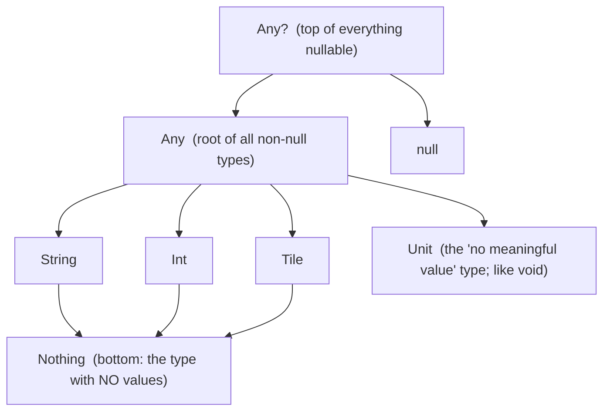

# 03 · Language core & the type system

> **Goal:** the Kotlin language itself, in enough depth to read anything in the project. You can
> already program, so this is organized around *what's different from JS/Python/Java*: the type
> system (including `Nothing` and nullability), the full null-safety toolkit, scope functions,
> classes and their variants (`data`/`enum`/`sealed`/`object`), and generics with variance.

← [02 · Kotlin → bytecode](02-kotlin-to-bytecode.md) · next → [04 · Functions & DSLs](04-functions-lambdas-dsl.md)

Everything here is REPL-pasteable: run `kotlin`, paste, observe.

---

## 1. `val`, `var`, and type inference

```kotlin
val low = 3          // read-only ("value"). Inferred type: Int. PREFER val.
var score = 0        // reassignable ("variable")
score += 10          // ok
// low = 4           // ❌ compile error

val high: Int = 6    // explicit type when you want to be clear or the inference is ambiguous
```

`val` means the *reference* can't be reassigned — not that the object is deeply immutable (a `val`
`MutableList` can still have items added). Default to `val`; it makes code easier to reason about and
is required for some optimizations. This is the same discipline as `const` in JS, but idiomatic and
pervasive here.

---

## 2. The type hierarchy: `Any`, `Unit`, `Nothing`, and nullability

Kotlin's types form a lattice with one top and one bottom, plus a nullable "mirror" for each type.



- **`Any`** — the root non-nullable type (Java's `Object`). Every non-null value is an `Any`.
- **`Any?`** — `Any` or `null`; the true top type. Every value whatsoever is an `Any?`.
- **`Unit`** — the type of functions that return "nothing useful." There is exactly one value, also
  written `Unit`. A function with no `: ReturnType` returns `Unit`. (Java's `void`, but a real type
  you can use as a generic argument.)
- **`Nothing`** — the **bottom** type: it has *no* instances. An expression of type `Nothing` never
  returns normally — it throws or loops forever. `throw` is of type `Nothing`, which is why
  `val x = name ?: throw ...` type-checks: the `throw` branch can stand in for any type. `TODO()`
  returns `Nothing` too.

You don't declare `Unit`/`Nothing` often, but recognizing them explains error messages and why
`?: throw` and `when` exhaustiveness work.

---

## 3. Null safety — the headline feature, in full

In Kotlin, an ordinary type **cannot hold `null`**. Nullability is part of the type, marked with `?`.
The compiler then *forces* you to handle the null case, eliminating most `NullPointerException`s
before the program runs.

```kotlin
var a: String = "hi"
// a = null          // ❌ won't compile — String is non-nullable

var b: String? = null // ✅ String? = "String or null"
```

The toolkit for *using* a nullable value:

```kotlin
val name: String? = maybeName()

val n1 = name?.length            // 1) SAFE CALL: null if name is null, else name.length (type Int?)
val n2 = name?.length ?: 0       // 2) ELVIS: the left, or 0 if that's null (type Int)
val n3 = name!!.length           // 3) NOT-NULL ASSERT: "I swear it's non-null" — throws NPE if wrong
if (name != null) {              // 4) SMART CAST: after the check, name IS String in this block
    println(name.length)         //    no ?. needed
}
name?.let { println(it.length) } // 5) let: run a block ONLY if non-null (see scope functions below)
```

Rules of thumb:
- Reach for `?.` and `?:` constantly; they're the everyday tools.
- **`!!` is a code smell** — it re-introduces the crash you came to Kotlin to avoid. Use only when you
  can *prove* non-null and the types can't express it.
- **`lateinit var`** — for non-null properties initialized *after* construction (e.g. Android
  lifecycle, dependency injection): `lateinit var repo: Repository`. Accessing it before assignment
  throws a clear "not initialized" error. Only for `var`, non-primitive, non-null.
- **Platform types** — values coming *from Java* (which has no nullability info) are "platform types"
  (shown as `String!`). Kotlin trusts you there; annotate/guard values crossing from Java. Relevant
  because the Android SDK and some libraries are Java.

This is why `Tile`'s `require(low in 0..6)` can assume non-null `Int`s — nullability never enters.

---

## 4. Scope functions: `let`, `run`, `with`, `apply`, `also`

Five tiny library functions that run a block "in the context of" an object. They differ on two axes
only: **how you refer to the object** (`this` vs `it`) and **what the block returns** (the object vs
the block's result). This official table is worth memorizing:

| Function | Refers to object as | Returns | Typical use |
|----------|--------------------|---------|-------------|
| `let`   | `it`   | lambda result | run code on a **non-null** value (`x?.let { }`); transform-and-return |
| `run`   | `this` | lambda result | configure **and** compute a result |
| `with`  | `this` | lambda result | group several calls on one object (not an extension) |
| `apply` | `this` | **the object** | **configure** an object, then return it |
| `also`  | `it`   | **the object** | a **side effect** (log/validate) mid-chain |

```kotlin
// apply — configure then return the object (great for builders/config):
val server = ServerConfig().apply {
    port = 8080
    host = "0.0.0.0"
}                                  // server is the configured ServerConfig

// let — do something only if non-null, and return a computed value:
val len = maybeName()?.let { it.trim().length } ?: 0

// also — peek without breaking the chain:
val tiles = Tile.allPairs().also { println("built ${it.size} tiles") }
```

Mnemonic: **`apply`/`also` return the object** (chain-friendly); **`let`/`run`/`with` return the
block's value** (transform-friendly). **`this`-forms (`run`/`with`/`apply`)** read cleanly when you
mostly touch the object's members; **`it`-forms (`let`/`also`)** read cleanly when you pass the object
around or want to avoid shadowing an outer `this`.

---

## 5. Control flow is expression-oriented

`if` and `when` are **expressions** (they produce values), so Kotlin has no ternary `?:`-for-`if` —
`if` *is* the ternary.

```kotlin
val label = if (score > 5) "big" else "small"    // if returns a value

val kind = when (n) {                              // when: the supercharged switch
    0 -> "zero"
    1, 2, 3 -> "small"
    in 4..6 -> "medium"        // ranges
    else -> "large"
}

val describe = when (x) {       // when with no subject + type checks (smart-cast inside each arm)
    is String -> "text of ${x.length}"
    is Int -> "number $x"
    else -> "other"
}
```

Loops and ranges:

```kotlin
for (i in 0..6) print(i)         // 0123456  — '..' is an inclusive IntRange (a real object)
for (i in 0 until 6) print(i)    // 012345   — half-open
for (i in 6 downTo 0 step 2) print(i)  // 6420
for (t in Tile.allPairs()) println(t)
for ((i, t) in Tile.allPairs().withIndex()) println("$i: $t")  // destructuring in the loop
```

`0..6` is an `IntRange` (a `Progression`), which is why `low in 0..6` in `Tile.init` reads naturally —
`in` calls `range.contains(low)`.

---

## 6. Classes, constructors, properties

```kotlin
class Player(
    val name: String,       // 'val' in the header → declares AND assigns a read-only property
    var chips: Int = 100    // 'var' → mutable property, with a default
) {
    // Secondary/derived state:
    val isBroke: Boolean get() = chips == 0      // computed property (no backing field)

    var lastBet: Int = 0
        private set                              // public getter, private setter

    init {                                       // runs during construction (like Tile.init)
        require(chips >= 0) { "chips can't be negative" }
    }

    fun bet(amount: Int) { chips -= amount; lastBet = amount }
}

val p = Player(name = "Alex")   // named argument; chips defaults to 100
```

Key points versus Java:
- The **primary constructor** is in the class header. `val`/`var` there both declare the property and
  assign it — no separate field + assignment.
- **`init {}`** blocks run in order during construction. `Tile` uses two `require(...)`s in `init` to
  reject invalid tiles.
- **Custom accessors**: `get()`/`set()` let a property compute or guard. `private set` is a common
  pattern for "read-only to the outside, writable inside."
- **Visibility**: `public` (default), `internal` (same Gradle module), `protected`, `private`. Note
  `internal` — visible within the whole module, useful for library boundaries like `core`.

---

## 7. Interfaces, abstract classes, and delegation

```kotlin
interface MoveValidator {
    fun isLegal(move: Move): Boolean          // abstract
    fun describe(): String = "a validator"    // interfaces CAN have default implementations
}

abstract class BaseValidator : MoveValidator {
    abstract val name: String                 // must be provided by subclasses
}

// Delegation with `by`: BlockingValidator gets MoveValidator's methods from `delegate`
class BlockingValidator(delegate: MoveValidator) : MoveValidator by delegate
```

`by` is **delegation** — "implement this interface by forwarding to that object." It's composition
without boilerplate. You'll also see property delegation: `val heavy by lazy { compute() }` computes
once, on first access, and caches (thread-safe by default).

---

## 8. `data`, `enum`, and `sealed` classes

**`data class`** — value semantics (see [Chapter 02](02-kotlin-to-bytecode.md#2-data-class--a-class-the-compiler-fills-in-for-you)).
Use for immutable data holders: tiles, moves, messages, DTOs.

**`enum class`** — a fixed set of named instances:

```kotlin
enum class Direction { LEFT, RIGHT }
enum class Suit(val pips: Int) {            // enums can carry data + methods
    BLANK(0), ACE(1), DEUCE(2);
    fun isBlank() = this == BLANK
}
```

**`sealed class`/`sealed interface`** — a closed hierarchy: all subtypes are known at compile time.
This is the backbone of a type-safe message protocol (exactly what the real-time game needs):

```kotlin
sealed interface GameMessage
data class PlayMove(val tile: Tile, val end: Direction) : GameMessage
data class Pass(val playerId: String) : GameMessage
data object GameOver : GameMessage           // 'data object' = singleton case

fun handle(msg: GameMessage) = when (msg) {   // NO `else` needed…
    is PlayMove -> "played ${msg.tile}"
    is Pass -> "${msg.playerId} passed"
    GameOver -> "game over"
}                                              // …because the compiler knows all cases are covered
```

The payoff: because the hierarchy is **sealed**, `when` is **exhaustive** without an `else`. Add a new
message type later and every `when` that handles `GameMessage` becomes a **compile error** until you
handle the new case — the compiler maintains your protocol for you. This is a major reason Kotlin is
great for a rules engine and a network protocol.

---

## 9. Generics and variance

Generics let a type work over many element types safely:

```kotlin
class Hand<T>(private val tiles: MutableList<T> = mutableListOf()) {
    fun add(t: T) { tiles.add(t) }
    fun all(): List<T> = tiles
}
val h = Hand<Tile>()
```

**Variance** answers: if `Tile` is a `GamePiece`, is a `List<Tile>` a `List<GamePiece>`? Kotlin uses
**declaration-site variance** with two modifiers (cleaner than Java's `? extends`/`? super` at every
use):

- **`out T` (covariant, a *producer*)** — the type only ever *comes out* (return positions). Then
  `Source<Tile>` **is a** `Source<GamePiece>`. This is why `List<out E>` (Kotlin's read-only `List`)
  lets you pass a `List<Tile>` where a `List<Any>` is expected.
  ```kotlin
  interface Source<out T> { fun next(): T }
  val s: Source<Any> = object : Source<String> { override fun next() = "x" }  // OK
  ```
- **`in T` (contravariant, a *consumer*)** — the type only ever *goes in* (parameter positions). Then
  `Comparator<Any>` **is a** `Comparator<Tile>`.
  ```kotlin
  interface Sink<in T> { fun accept(t: T) }
  val sink: Sink<String> = object : Sink<Any> { override fun accept(t: Any) {} }  // OK
  ```

Mnemonic from the docs: **"Consumer `in`, Producer `out`."** And `*` is a **star projection** for
"some unknown type argument" (`List<*>` ≈ `List<out Any?>` for reading). You'll rarely *write*
variance early on, but you'll *read* it constantly (`List<out E>`, `Comparable<in T>`), and now it
won't be noise.

---

## Recap

- **Prefer `val`**; nullability is in the type (`T` vs `T?`); handle null with `?.`, `?:`, smart
  casts, `let` — avoid `!!`.
- The hierarchy: **`Any?` ⊃ `Any` ⊃ your types ⊃ `Nothing`**; `Unit` = "no useful value."
- **Scope functions**: `apply`/`also` return the object; `let`/`run`/`with` return the block result.
- `if`/`when` are **expressions**; `when` + **`sealed`** gives compiler-checked exhaustiveness — ideal
  for the move protocol.
- Classes: primary constructor properties, `init`, custom accessors, `internal` visibility,
  delegation (`by`, `lazy`).
- **Variance**: `out` = producer/covariant, `in` = consumer/contravariant.

**Sources:** [null safety](https://kotlinlang.org/docs/null-safety.html),
[scope functions](https://kotlinlang.org/docs/scope-functions.html),
[classes](https://kotlinlang.org/docs/classes.html),
[sealed classes](https://kotlinlang.org/docs/sealed-classes.html),
[generics & variance](https://kotlinlang.org/docs/generics.html),
[basic types](https://kotlinlang.org/docs/basic-types.html).

Next: functions as values, and the one idea (**lambda with receiver**) that unlocks every Ktor and
Compose `{ }` block. → [04 · Functions, lambdas & DSLs](04-functions-lambdas-dsl.md)
