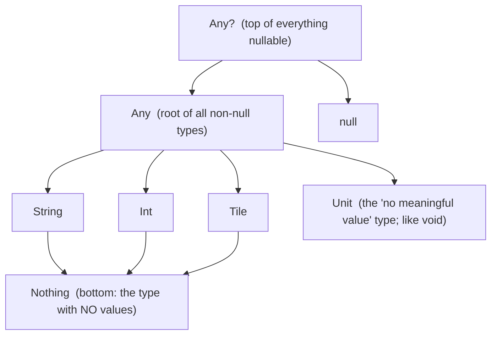

# 03 · Language core & the type system

You already know how to program, so this chapter doesn't waste your time on loops and conditionals as
if they were new. Instead it's organized around what's genuinely *different* about Kotlin coming from
JavaScript, Python, and Java — the parts that will trip you up or delight you precisely because they
don't match your instincts. That means the type system, including the odd-but-useful corners like
`Nothing`; nullability as a first-class part of the type; the five little scope functions everyone
confuses; classes and their several flavors; and generics with variance. Get through this and you can
read essentially any Kotlin in the project.

← [02 · Kotlin → bytecode](02-kotlin-to-bytecode.md) · next → [04 · Functions & DSLs](04-functions-lambdas-dsl.md)

Everything here is REPL-pasteable — run `kotlin`, paste a snippet, watch what it does.

---

## 1. `val`, `var`, and type inference

```kotlin
val low = 3          // read-only ("value"). Inferred type: Int. PREFER val.
var score = 0        // reassignable ("variable")
score += 10          // ok
// low = 4           // ❌ compile error

val high: Int = 6    // explicit type when you want to be clear or the inference is ambiguous
```

The one nuance worth internalizing early is what `val` actually promises. It means the *reference*
can't be reassigned — not that the object it points at is frozen. A `val` holding a `MutableList` will
happily let you add items to that list; what you can't do is point `low` at a different value. This is
the same distinction JavaScript draws with `const`, but in Kotlin it's the default you reach for
constantly rather than the exception. Defaulting to `val` makes code easier to reason about — you can
read a `val` once and trust it won't change under you — and it's a habit worth forming from line one.

---

## 2. The type hierarchy: `Any`, `Unit`, `Nothing`, and nullability

Kotlin's types form a lattice with a single top, a single bottom, and a nullable "mirror" for every
type. The diagram is easier to absorb than the prose:



At the top sits `Any`, the root of all non-nullable types — Java's `Object` by another name, the type
every non-null value shares. Widen it to admit `null` and you get `Any?`, the true top of the whole
system: literally every value, including `null`, is an `Any?`. Down at the leaves, two special types
are worth knowing by name. `Unit` is the type of functions that return nothing useful; there's exactly
one value, also spelled `Unit`, and a function with no declared return type returns it. It's Java's
`void`, except that unlike `void` it's a real type you can hand to a generic. And `Nothing` is the
bottom of the lattice — the type with *no* instances at all. An expression of type `Nothing` never
returns normally; it either throws or loops forever. That sounds like a curiosity until you realize
`throw` itself has type `Nothing`, which is exactly why `val x = name ?: throw ...` type-checks: the
`throw` branch can stand in for a value of any type, because a type with no values fits anywhere.
`TODO()` works the same way. You won't declare `Unit` or `Nothing` often, but recognizing them is what
makes half of Kotlin's error messages and the exhaustiveness rules later in this chapter make sense.

---

## 3. Null safety — the headline feature, in full

This is the feature people mean when they say Kotlin is "safer than Java." In Kotlin an ordinary type
simply cannot hold `null`. Nullability is part of the type itself, spelled with a trailing `?`, and the
compiler then forces you to deal with the null case at every point it could occur — which eliminates
most `NullPointerException`s before the program ever runs.

```kotlin
var a: String = "hi"
// a = null          // ❌ won't compile — String is non-nullable

var b: String? = null // ✅ String? = "String or null"
```

The interesting part is the small toolkit for *working with* a value that might be null. It's worth
seeing all of it together and then talking through when each piece earns its place:

```kotlin
val name: String? = maybeName()

val n1 = name?.length            // 1) SAFE CALL: null if name is null, else name.length (type Int?)
val n2 = name?.length ?: 0       // 2) ELVIS: the left, or 0 if that's null (type Int)
val n3 = name!!.length           // 3) NOT-NULL ASSERT: "I swear it's non-null" — throws NPE if wrong
if (name != null) {              // 4) SMART CAST: after the check, name IS String in this block
    println(name.length)         //    no ?. needed
}
name?.let { println(it.length) } // 5) let: run a block ONLY if non-null (see scope functions below)
```

The safe call `?.` and the Elvis operator `?:` are the two you'll reach for constantly, usually
together: `name?.length ?: 0` reads as "the length if there is one, otherwise zero," and it's the
everyday shape of null handling. The smart cast is the quiet convenience — once you've checked
`name != null`, the compiler knows `name` is a plain `String` for the rest of that block and lets you
use it without any `?.` at all. And `let` is the tool for "do this only if the value is present,"
which comes up so often it's practically idiom.

The one to be wary of is `!!`, the not-null assertion. It tells the compiler "trust me, this isn't
null" and throws a `NullPointerException` on the spot if you're wrong — which is to say it hands back
the exact crash you came to Kotlin to avoid. Personally I treat it as a smell: if I've written `!!`,
it usually means the types could have expressed the guarantee and I got lazy. There are honest uses —
cases where you can prove non-null but the type system can't follow the proof — but they're rarer than
first instincts suggest.

Two related tools round this out. `lateinit var` is for non-null properties that genuinely can't be
set at construction time — the classic cases are Android lifecycle callbacks and dependency injection,
where the value arrives a moment after the object exists. You declare `lateinit var repo: Repository`,
and if you touch it before it's assigned you get a clear "property not initialized" error rather than a
vague NPE. It's limited to `var`, non-primitive, non-null properties. The other is *platform types*:
values crossing over from Java, which carries no nullability information, show up with a `String!` sort
of notation. Kotlin trusts you there rather than forcing a decision, which means it's on you to guard
or annotate values coming from Java code — a live concern here, since much of the Android SDK and some
libraries are Java underneath. Notice, incidentally, that none of this touches `Tile`'s
`require(low in 0..6)`: those are non-null `Int`s, so nullability never even enters the picture.

---

## 4. Scope functions: `let`, `run`, `with`, `apply`, `also`

These five are tiny library functions that each run a block "in the context of" some object, and
they're a common source of early confusion because they look so similar. The trick is that they differ
along only two axes, and once you hold those two axes in mind the whole family falls into place. The
first axis is how the block refers to the object — as `this` (an implicit receiver) or as `it` (a named
parameter). The second is what the whole expression evaluates to — the object itself, or the result of
the block. This is the official summary, and it really is worth keeping nearby until it's second
nature:

| Function | Refers to object as | Returns | Typical use |
|----------|--------------------|---------|-------------|
| `let`   | `it`   | lambda result | run code on a non-null value (`x?.let { }`); transform-and-return |
| `run`   | `this` | lambda result | configure and compute a result |
| `with`  | `this` | lambda result | group several calls on one object (not an extension) |
| `apply` | `this` | the object | configure an object, then return it |
| `also`  | `it`   | the object | a side effect (log/validate) mid-chain |

Reading the "returns" column top to bottom is the fastest way to choose: `apply` and `also` hand you
back the object, which makes them the chain-friendly pair for configuring or peeking at something and
carrying on; `let`, `run`, and `with` hand back the block's value, which makes them the ones for
transforming an object into something else. The `this`-forms read cleanly when the block mostly touches
the object's own members, and the `it`-forms read cleanly when you're passing the object around or want
to avoid shadowing an outer `this`. In practice a few uses cover most of your day:

```kotlin
// apply — configure then return the object (great for builders/config):
val server = ServerConfig().apply {
    port = 8080
    host = "0.0.0.0"
}                                  // server is the configured ServerConfig

// let — do something only if non-null, and return a computed value:
val len = maybeName()?.let { it.trim().length } ?: 0

// also — peek without breaking the chain:
val tiles = Tile.allPairs().also { println("built ${it.size} tiles") }
```

---

## 5. Control flow is expression-oriented

A structural difference from Java worth flagging up front: in Kotlin `if` and `when` are *expressions*,
meaning they produce a value. That's why Kotlin has no ternary `? :` operator — it doesn't need one,
because `if` already is the ternary.

```kotlin
val label = if (score > 5) "big" else "small"    // if returns a value

val kind = when (n) {                              // when: the supercharged switch
    0 -> "zero"
    1, 2, 3 -> "small"
    in 4..6 -> "medium"        // ranges
    else -> "large"
}

val describe = when (x) {       // when with no subject + type checks (smart-cast inside each arm)
    is String -> "text of ${x.length}"
    is Int -> "number $x"
    else -> "other"
}
```

`when` is worth dwelling on because it does far more than a `switch`: it matches literal values, groups
several with commas, tests ranges with `in`, and — in the subjectless form — checks types, smart-casting
inside each arm so `x.length` just works after `is String`. The same range machinery shows up in loops:

```kotlin
for (i in 0..6) print(i)         // 0123456  — '..' is an inclusive IntRange (a real object)
for (i in 0 until 6) print(i)    // 012345   — half-open
for (i in 6 downTo 0 step 2) print(i)  // 6420
for (t in Tile.allPairs()) println(t)
for ((i, t) in Tile.allPairs().withIndex()) println("$i: $t")  // destructuring in the loop
```

`0..6` isn't magic syntax — it's an actual `IntRange` object (a `Progression`), which is exactly why
`low in 0..6` back in `Tile.init` reads so naturally: `in` is calling `range.contains(low)` on a real
object.

---

## 6. Classes, constructors, properties

Kotlin's class syntax collapses a lot of Java boilerplate into the class header, and the example below
shows most of what you'll meet day to day:

```kotlin
class Player(
    val name: String,       // 'val' in the header → declares AND assigns a read-only property
    var chips: Int = 100    // 'var' → mutable property, with a default
) {
    // Secondary/derived state:
    val isBroke: Boolean get() = chips == 0      // computed property (no backing field)

    var lastBet: Int = 0
        private set                              // public getter, private setter

    init {                                       // runs during construction (like Tile.init)
        require(chips >= 0) { "chips can't be negative" }
    }

    fun bet(amount: Int) { chips -= amount; lastBet = amount }
}

val p = Player(name = "Alex")   // named argument; chips defaults to 100
```

The biggest departure from Java is the *primary constructor* right there in the header, where putting
`val` or `var` in front of a parameter both declares the property and assigns it in one move — no
separate field declaration and constructor body to keep in sync. Inside the class, `init {}` blocks run
in order during construction, which is where `Tile` does its two `require(...)` checks to reject invalid
tiles. Custom accessors let a property compute or guard its value, and the `private set` you see on
`lastBet` is a common and useful shape: readable from anywhere, writable only from inside. One last
thing to file away is visibility. Alongside the usual `public` (the default), `private`, and
`protected`, Kotlin adds `internal`, meaning "visible within this whole Gradle module." That's the
modifier you'd use to draw a boundary inside a library like `core` — public to the module, invisible to
its consumers.

---

## 7. Interfaces, abstract classes, and delegation

```kotlin
interface MoveValidator {
    fun isLegal(move: Move): Boolean          // abstract
    fun describe(): String = "a validator"    // interfaces CAN have default implementations
}

abstract class BaseValidator : MoveValidator {
    abstract val name: String                 // must be provided by subclasses
}

// Delegation with `by`: BlockingValidator gets MoveValidator's methods from `delegate`
class BlockingValidator(delegate: MoveValidator) : MoveValidator by delegate
```

Most of this maps onto ideas you already have — interfaces can carry default method bodies, abstract
classes can demand that subclasses supply members — but `by` is the piece that's likely new. It's
*delegation*: "implement this interface by forwarding every call to that object." It gives you
composition without the tedium of hand-writing forwarding methods, and you'll meet its cousin,
property delegation, in the shape `val heavy by lazy { compute() }`, which computes its value once on
first access and caches it (thread-safely by default).

---

## 8. `data`, `enum`, and `sealed` classes

Beyond the plain `class`, Kotlin has three specialized flavors, and the third of them is the backbone
of the real-time game, so it's worth building up to. The first, `data class`, you've already met from
the bytecode side in [Chapter 02](02-kotlin-to-bytecode.md#2-data-class--a-class-the-compiler-fills-in-for-you):
value semantics for free, ideal for immutable holders like tiles, moves, messages, and DTOs. The
second, `enum class`, is a fixed set of named instances that — unlike Java enums you might remember —
can carry their own data and methods:

```kotlin
enum class Direction { LEFT, RIGHT }
enum class Suit(val pips: Int) {            // enums can carry data + methods
    BLANK(0), ACE(1), DEUCE(2);
    fun isBlank() = this == BLANK
}
```

The third flavor, `sealed`, is the one that pays off most in this project, so let's build it up rather
than just state it. Start with the smallest possible protocol — a single kind of message:

```kotlin
sealed interface GameMessage
data class PlayMove(val tile: Tile, val end: Direction) : GameMessage
```

A `sealed` interface (or class) declares a *closed* hierarchy: every subtype has to be defined in the
same module, so the compiler knows the complete list of possibilities at compile time. That knowledge
is what makes the next step powerful. Add the other messages a game actually needs and write the
handler:

```kotlin
data class Pass(val playerId: String) : GameMessage
data object GameOver : GameMessage           // 'data object' = singleton case

fun handle(msg: GameMessage) = when (msg) {   // NO `else` needed…
    is PlayMove -> "played ${msg.tile}"
    is Pass -> "${msg.playerId} passed"
    GameOver -> "game over"
}                                              // …because the compiler knows all cases are covered
```

Because the hierarchy is sealed, that `when` is *exhaustive* without an `else` clause — the compiler
can see all three cases are handled. Now watch what happens the moment you extend the protocol, because
this is the real payoff and the reason to prefer `sealed` for a network message type. Suppose you add a
fourth message, say `data class Draw(val playerId: String) : GameMessage`. Every `when` in the codebase
that switches over `GameMessage` and *doesn't* yet handle `Draw` immediately becomes a compile error.
The compiler won't let you forget a case. Instead of a protocol that silently does the wrong thing when
you add a message and miss a spot, you get a to-do list of exactly which handlers need updating,
enforced at build time. That property — the compiler maintaining your protocol for you — is a large part
of why Kotlin is such a good fit for both a rules engine and a wire format.

---

## 9. Generics and variance

Generics let one type work safely over many element types, which is routine and probably familiar:

```kotlin
class Hand<T>(private val tiles: MutableList<T> = mutableListOf()) {
    fun add(t: T) { tiles.add(t) }
    fun all(): List<T> = tiles
}
val h = Hand<Tile>()
```

*Variance* is the part that's easy to get hazy about, so here's the question it answers: if `Tile` is a
`GamePiece`, is a `List<Tile>` therefore a `List<GamePiece>`? The answer isn't automatically yes, and
Kotlin lets you say when it should be, using declaration-site variance — you annotate the type once,
where it's defined, rather than at every use the way Java's `? extends` / `? super` forces you to.

There are two annotations. `out T` marks a type as *covariant* — a producer that only ever hands `T`
values *out*, in return positions. When a type only produces, a `Source<Tile>` safely *is* a
`Source<GamePiece>`, because anything expecting to receive `GamePiece`s is perfectly happy receiving
`Tile`s. This is exactly why Kotlin's read-only `List` is declared `List<out E>`, and why you can pass a
`List<Tile>` where a `List<Any>` is expected:

```kotlin
interface Source<out T> { fun next(): T }
val s: Source<Any> = object : Source<String> { override fun next() = "x" }  // OK
```

`in T` marks the mirror image — *contravariant*, a consumer that only ever takes `T` values *in*, in
parameter positions. When a type only consumes, a `Comparator<Any>` safely *is* a `Comparator<Tile>`,
because something that can compare any two objects can certainly compare two tiles:

```kotlin
interface Sink<in T> { fun accept(t: T) }
val sink: Sink<String> = object : Sink<Any> { override fun accept(t: Any) {} }  // OK
```

The docs boil it down to "consumer `in`, producer `out`," and that phrase is genuinely all you need to
recall it. The `*` you'll occasionally see — a *star projection*, as in `List<*>` — just means "some
unknown type argument," roughly `List<out Any?>` for the purposes of reading. You'll rarely *write*
variance in your first months, but you'll *read* it everywhere (`List<out E>`, `Comparable<in T>`), and
now it reads as meaning rather than noise.

---

That's the shape of the language: prefer `val`; keep nullability in the type and handle it with `?.`,
`?:`, smart casts, and `let` rather than `!!`; picture the hierarchy as `Any?` above `Any` above your
own types above `Nothing`, with `Unit` as the "no useful value" type. `if` and `when` are expressions,
and `when` over a `sealed` type gives you exhaustiveness the compiler enforces — the property that makes
the move protocol safe to grow. Classes fold their state into the header via the primary constructor,
guard it in `init`, and can compose behavior with `by`. And variance is just "producers are `out`,
consumers are `in`." Next we turn to functions as values, and to the single idea — lambda with
receiver — that unlocks why every Ktor and Compose `{ }` block looks the way it does.
→ [04 · Functions, lambdas & DSLs](04-functions-lambdas-dsl.md)

*Further reading: [null safety](https://kotlinlang.org/docs/null-safety.html),
[scope functions](https://kotlinlang.org/docs/scope-functions.html),
[classes](https://kotlinlang.org/docs/classes.html),
[sealed classes](https://kotlinlang.org/docs/sealed-classes.html),
[generics & variance](https://kotlinlang.org/docs/generics.html), and
[basic types](https://kotlinlang.org/docs/basic-types.html).*
