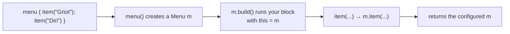
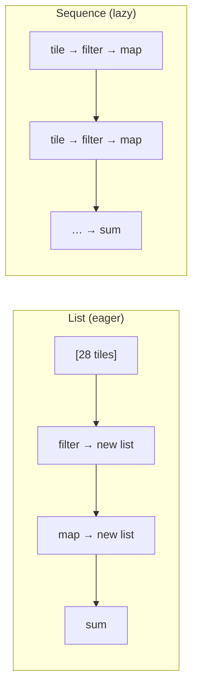

# 04 · Functions, lambdas & building a DSL

There's one idea in this chapter that, once it clicks, retroactively explains almost every strange-
looking `{ }` block in the project — `routing { }`, `install(...) { }`, `Column { }`,
`embeddedServer(...) { }`, even `apply { }`. It's called *lambda with receiver*, and everything before
it here is groundwork and everything after it is consequence. So we start with functions as ordinary
values, build up to that one idea, prove it by writing a small DSL from scratch, and finish with
`inline`/`reified` and the collection pipelines you'll use to shuffle data around.

← [03 · Language core](03-language-core.md) · next → [05 · Coroutines & Flow](05-coroutines-and-flow.md)

---

## 1. Functions are values; lambdas are function literals

The starting point is that a function is a value like any other. A *function type* is written
`(Params) -> ReturnType`, a lambda `{ ... }` is a literal of that type, and you can store one in a
variable, pass it as an argument, or return it from another function.

```kotlin
val add: (Int, Int) -> Int = { a, b -> a + b }   // a value whose type is (Int, Int) -> Int
println(add(2, 3))                                // 5

fun apply2(x: Int, f: (Int) -> Int): Int = f(x)  // higher-order fn: takes a function
println(apply2(10) { it * 2 })                    // 20   — `it` is the single param's name
```

A couple of conventions in that snippet are worth naming. A function that takes or returns another
function is *higher-order*. A lambda with a single parameter doesn't need you to name that parameter —
it's implicitly called `it`, though you can name it yourself with `{ n -> ... }`. And then there's the
rule that does more to shape Kotlin's look than any other: if the *last* argument to a function is
itself a function, you can move that lambda outside the parentheses, and if it's the *only* argument,
the parentheses disappear entirely.

```kotlin
apply2(10, { it * 2 })   // normal
apply2(10) { it * 2 }    // trailing lambda — the { } moved outside the ( )
listOf(1,2,3).map { it * 10 }   // map's only arg is a lambda → no parens at all
```

That single "trailing lambda" rule is why `get("/") { ... }`, `webSocket("/ws") { ... }`, and even
`install(WebSockets)` (a call whose optional lambda is simply omitted) all look the way they do. None
of it is special syntax; it's this one rule applied over and over.

Closures come along for free, and they behave just as they do in JavaScript: a lambda captures — closes
over — variables from the scope around it.

```kotlin
fun counter(): () -> Int { var n = 0; return { n++ } }   // the returned lambda closes over n
val c = counter(); println("${c()}${c()}${c()}")          // 012
```

---

## 2. Lambda with receiver — the one idea that unlocks the project

Here's the idea everything has been leading to. An ordinary lambda has a type like `(A) -> B`. A
*lambda with receiver* has the type `A.() -> B`, and the difference is small to write but large in
effect: the block runs *as if it were a method on an `A`*. Inside it, `this` is the receiver, so you
call the receiver's members with no prefix at all.

Set the two side by side:

```kotlin
val f1: (StringBuilder) -> Unit = { sb -> sb.append("hi") }   // ordinary: object is a PARAMETER
val f2: StringBuilder.() -> Unit = { append("hi") }           // with receiver: object is `this`
```

In `f2`, that bare `append(...)` resolves to `this.append(...)`, where `this` is the `StringBuilder`.
That's the entire mechanism. And it connects straight back to the previous chapter's bytecode: recall
from [Chapter 02](02-kotlin-to-bytecode.md#6-extension-functions--static-methods-the-receiver-becomes-the-first-parameter)
that a receiver is really just a hidden first parameter. So `A.() -> B` is `(A) -> B` all along, with
`this`-flavored sugar sprinkled on top.

The best way to believe this is to build the thing frameworks are built out of. Let's make a tiny
builder — a stand-in for an HTML or menu builder — that exposes exactly the machinery Ktor and Compose
use, and let it grow from nothing into a working DSL.

```kotlin
class Menu {
    private val items = mutableListOf<String>()
    fun item(name: String) { items.add(name) }      // a method on Menu
    override fun toString() = items.joinToString(", ")
}

// The builder function takes a lambda WITH RECEIVER of type Menu:
fun menu(build: Menu.() -> Unit): Menu {
    val m = Menu()      // 1. create the receiver
    m.build()           // 2. run the caller's block AS IF it were a method on m (this = m)
    return m            // 3. hand back the configured object
}

// Usage — look how the calls inside the braces have no prefix:
val lunch = menu {
    item("Griot")       // means this.item("Griot"), where this is the Menu
    item("Diri")
    item("Bannann")
}
println(lunch)          // Griot, Diri, Bannann
```

Trace the flow once and the "magic" evaporates. The `menu` function creates a `Menu`, runs your block
with that `Menu` as the receiver, and returns it configured; each bare `item(...)` inside your block is
really `m.item(...)`.



Now the point of the whole exercise: the real code you already have is this same pattern, only with
richer receivers. Every one of these blocks works exactly like `menu { }` — the framework creates a
receiver, runs your block on it, and uses the result.

| Your project code | The receiver (`this`) inside the braces | So the calls inside mean |
|-------------------|------------------------------------------|--------------------------|
| `routing { get("/") { } }` | a `Routing` object | `this.get("/") { }` |
| `install(WebSockets) { }` | that plugin's config object | configure the plugin |
| `embeddedServer(Netty, ...) { module() }` | an `Application` | `this.module()` |
| `Column { Text("Home") }` | a `ColumnScope` | emit children into the column |
| `Person().apply { age = 32 }` | the `Person` | `this.age = 32` |

This is the reason the project's server and UI code reads like declarative configuration rather than a
sequence of imperative calls: each `{ }` is a lambda with receiver, nothing more. There's no magic left
in it once you've written `menu`.

One footnote to head off a later confusion: `fun Application.module()` in the server is the
extension-function cousin of the same idea — a function whose `this` is an `Application`. Ktor could
just as well have taken it as an `Application.() -> Unit` lambda. Same "receiver" concept, two spellings
of it.

---

## 3. `inline` and `reified`

Higher-order functions have a small cost: normally each lambda you pass becomes a little object
allocated at runtime. The `inline` keyword tells the compiler to copy the function's body — and the
bodies of the lambdas it receives — straight into the call site, which erases that per-call overhead.
That's why `map`, `filter`, `forEach`, `apply`, `let`, and Compose's building blocks are all `inline`:
in a hot loop they cost nothing extra.

Inlining also enables something you'll consume long before you write it — `reified` type parameters,
which keep a generic type available at runtime instead of erasing it:

```kotlin
inline fun <reified T> Any.isA(): Boolean = this is T   // 'reified' → we can use T with `is`
println("x".isA<String>())   // true
```

You'll lean on `reified` APIs constantly — `Json.decodeFromString<Health>(text)` figures out the target
type from `T` — well before you have any reason to define one yourself.

---

## 4. SAM interfaces (Java interop)

A lot of Java APIs want an object implementing a single-method interface — a "SAM," for Single Abstract
Method, like `Runnable`. Kotlin lets you skip the ceremony and pass a lambda where such an interface is
expected:

```kotlin
val r = Runnable { println("run!") }     // lambda auto-converted to the Runnable SAM
Thread(r).start()
```

This matters here because the Android SDK and various Java libraries hand you listener and callback
interfaces, and SAM conversion is what lets you satisfy them with a lambda instead of an anonymous
class.

---

## 5. Collections & sequences (the data pipelines)

Kotlin's standard library turns data-wrangling into readable, top-to-bottom pipelines. Each operation
takes a collection and returns one, so they chain:

```kotlin
val doubles = Tile.allPairs()
    .filter { it.isDouble }              // keep [0|0]..[6|6]
    .map { it.total }                 // 0, 2, 4, ... 12
    .sum()                               // 42
```

You don't need the whole library by heart, but it helps to know the families so you can reach for
the right shape — keeping and dropping, transforming, inspecting, reducing, and regrouping:

| Goal | Operators |
|------|-----------|
| keep/drop | `filter`, `filterNot`, `take`, `drop`, `distinct` |
| transform | `map`, `flatMap`, `mapNotNull`, `withIndex` |
| inspect | `forEach`, `any`, `all`, `none`, `count`, `find`, `first`/`firstOrNull` |
| reduce | `sum`, `fold`, `reduce`, `maxByOrNull`, `minByOrNull` |
| regroup | `groupBy`, `associate`, `associateBy`, `partition`, `sortedBy` |

With those in hand, the one genuinely dense line in `Tile` becomes readable:

```kotlin
(0..6).flatMap { a -> (a..6).map { b -> Tile(a, b) } }
// for each a in 0..6: build tiles (a..6) → flatMap concatenates the 7 sub-lists into one 28-element list
```

There's one performance wrinkle worth understanding, because it changes how you write large pipelines.
Chaining operations on a `List` builds a brand-new intermediate list at every step — completely fine
for twenty-eight tiles, potentially wasteful for a big or expensive chain. Calling `.asSequence()`
makes the pipeline *lazy* instead: each element flows through the entire chain one at a time, and a
terminal operation like `toList()` or `sum()` is what drives the whole thing. Same operators, different
evaluation strategy.



The rule of thumb is simple: default to plain `List` operators, and switch to `asSequence()` when the
collection is large or you'd otherwise be building a pile of throwaway intermediate lists.

---

The thread through this chapter is that Kotlin's expressive syntax is a few small mechanisms reused
relentlessly. Functions are values; the last function argument becomes a trailing lambda outside the
parentheses; and a lambda with receiver, `A.() -> B`, is just a block where `this` is an object the
caller supplied. That last one is the whole trick behind `routing { }`, `install { }`, `Column { }`,
and `embeddedServer { }` — and you proved it to yourself by building `menu { item(...) }` from scratch.
`inline` removes the lambda overhead and unlocks `reified` runtime types, and the collection operators
chain into pipelines you can make lazy with `asSequence()`. Next: the concurrency engine sitting under
the server's WebSocket loop and under Compose's redraws.
→ [05 · Coroutines & Flow](05-coroutines-and-flow.md)

*Further reading: [higher-order functions & lambdas](https://kotlinlang.org/docs/lambdas.html) (function
types, trailing lambdas, `it`, and function literals with receiver),
[inline functions](https://kotlinlang.org/docs/inline-functions.html),
[collections overview](https://kotlinlang.org/docs/collections-overview.html),
[sequences](https://kotlinlang.org/docs/sequences.html), and
[type-safe builders](https://kotlinlang.org/docs/type-safe-builders.html).*
