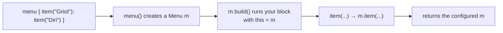
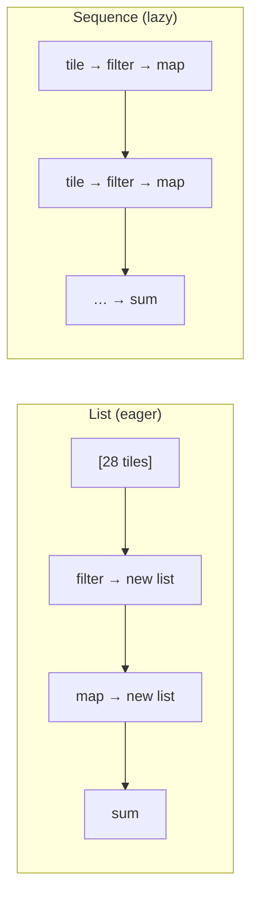

# 04 · Functions, lambdas & building a DSL

> **Goal:** functions as values, and the single most important idea for reading this project's code —
> **lambda with receiver**. Once you understand it, every `{ }` block in Ktor and Compose
> (`routing { }`, `install(...) { }`, `Column { }`, `embeddedServer(...) { }`, `apply { }`) reveals
> its machinery. We finish with `inline`/`reified` and Kotlin's collection/sequence pipelines.

← [03 · Language core](03-language-core.md) · next → [05 · Coroutines & Flow](05-coroutines-and-flow.md)

---

## 1. Functions are values; lambdas are function literals

A **function type** is written `(Params) -> ReturnType`. A **lambda** `{ ... }` is a literal of that
type. You can store functions in variables, pass them as arguments, and return them.

```kotlin
val add: (Int, Int) -> Int = { a, b -> a + b }   // a value whose type is (Int, Int) -> Int
println(add(2, 3))                                // 5

fun apply2(x: Int, f: (Int) -> Int): Int = f(x)  // higher-order fn: takes a function
println(apply2(10) { it * 2 })                    // 20   — `it` is the single param's name
```

- A function that **takes or returns** a function is **higher-order**.
- A single-parameter lambda's parameter is implicitly named **`it`** (you can name it: `{ n -> ... }`).
- **Trailing-lambda rule (crucial):** if the *last* argument is a function, it can go **outside** the
  parentheses. And if it's the *only* argument, the parentheses vanish entirely:

```kotlin
apply2(10, { it * 2 })   // normal
apply2(10) { it * 2 }    // trailing lambda — the { } moved outside the ( )
listOf(1,2,3).map { it * 10 }   // map's only arg is a lambda → no parens at all
```

That rule alone explains why `get("/") { ... }`, `webSocket("/ws") { ... }`, and `install(WebSockets)`
(a call with the lambda omitted) look the way they do.

**Closures:** a lambda captures variables from its surrounding scope (a "closure"), like in JS:

```kotlin
fun counter(): () -> Int { var n = 0; return { n++ } }   // the returned lambda closes over n
val c = counter(); println("${c()}${c()}${c()}")          // 012
```

---

## 2. Lambda **with receiver** — the one idea that unlocks the project

A normal lambda type is `(A) -> B`. A **lambda with receiver** has type **`A.() -> B`**: it's a
function that runs *as if it were a method on an `A`*. Inside the block, **`this` is the receiver**,
so you call the receiver's members with no prefix.

Contrast the two:

```kotlin
val f1: (StringBuilder) -> Unit = { sb -> sb.append("hi") }   // ordinary: object is a PARAMETER
val f2: StringBuilder.() -> Unit = { append("hi") }           // with receiver: object is `this`
```

In `f2`, `append(...)` resolves to `this.append(...)` where `this` is the `StringBuilder`. That's the
whole trick. Recall from [Chapter 02](02-kotlin-to-bytecode.md#6-extension-functions--static-methods-the-receiver-becomes-the-first-parameter):
a receiver just compiles to a hidden first parameter — so `A.() -> B` is really `(A) -> B` with `this`
sugar.

### Build a DSL from scratch (this *is* how `routing { }` works)

Let's make a tiny HTML-ish builder to expose the exact mechanism Ktor and Compose use.

```kotlin
class Menu {
    private val items = mutableListOf<String>()
    fun item(name: String) { items.add(name) }      // a method on Menu
    override fun toString() = items.joinToString(", ")
}

// The builder function takes a lambda WITH RECEIVER of type Menu:
fun menu(build: Menu.() -> Unit): Menu {
    val m = Menu()      // 1. create the receiver
    m.build()           // 2. run the caller's block AS IF it were a method on m (this = m)
    return m            // 3. hand back the configured object
}

// Usage — look how the calls inside the braces have no prefix:
val lunch = menu {
    item("Griot")       // means this.item("Griot"), where this is the Menu
    item("Diri")
    item("Bannann")
}
println(lunch)          // Griot, Diri, Bannann
```



Now map it onto the real code you already have:

| Your project code | The receiver (`this`) inside the braces | So the calls inside mean |
|-------------------|------------------------------------------|--------------------------|
| `routing { get("/") { } }` | a `Routing` object | `this.get("/") { }` |
| `install(WebSockets) { }` | that plugin's config object | configure the plugin |
| `embeddedServer(Netty, ...) { module() }` | an `Application` | `this.module()` |
| `Column { Text("Home") }` | a `ColumnScope` | emit children into the column |
| `Person().apply { age = 32 }` | the `Person` | `this.age = 32` |

**This single concept is why the whole project's UI and server code reads like declarative
configuration.** Each `{ }` is a lambda-with-receiver; the framework creates the receiver, runs your
block on it, and uses the result. Nothing magic — just `A.() -> B` plus the trailing-lambda rule.

> `fun Application.module()` in the server is the *extension-function* cousin of the same idea: a
> function whose `this` is an `Application`. Ktor could equally take it as an `Application.() -> Unit`
> lambda. Same "receiver" concept, two syntaxes.

---

## 3. `inline` and `reified`

Higher-order functions normally allocate a small object per lambda. **`inline`** tells the compiler to
**copy the function's body (and the lambda's body) into the call site**, removing that overhead — which
is why `map`, `filter`, `forEach`, `apply`, `let`, and Compose's building blocks are `inline`: zero
per-call lambda cost in hot loops.

Inlining enables **`reified`** type parameters — keeping the generic type available at runtime (normally
it's erased):

```kotlin
inline fun <reified T> Any.isA(): Boolean = this is T   // 'reified' → we can use T with `is`
println("x".isA<String>())   // true
```

You'll *use* `reified` APIs constantly (e.g. `Json.decodeFromString<Health>(text)` figures out the
type from `T`) even before you *write* one.

---

## 4. SAM interfaces (Java interop)

Many Java APIs want a single-method interface (a "SAM": Single Abstract Method), e.g. `Runnable`.
Kotlin lets you pass a lambda directly:

```kotlin
val r = Runnable { println("run!") }     // lambda auto-converted to the Runnable SAM
Thread(r).start()
```

Relevant because the Android SDK and some Java libraries expect listeners/callbacks; you hand them
lambdas.

---

## 5. Collections & sequences (the data pipelines)

Kotlin's standard library gives rich, chainable operations on collections. They read top-to-bottom
like a pipeline:

```kotlin
val doubles = Tile.allPairs()
    .filter { it.isDouble }              // keep [0|0]..[6|6]
    .map { it.total }                 // 0, 2, 4, ... 12
    .sum()                               // 42
```

The families you'll use most:

| Goal | Operators |
|------|-----------|
| keep/drop | `filter`, `filterNot`, `take`, `drop`, `distinct` |
| transform | `map`, `flatMap`, `mapNotNull`, `withIndex` |
| inspect | `forEach`, `any`, `all`, `none`, `count`, `find`, `first`/`firstOrNull` |
| reduce | `sum`, `fold`, `reduce`, `maxByOrNull`, `minByOrNull` |
| regroup | `groupBy`, `associate`, `associateBy`, `partition`, `sortedBy` |

Your `Tile.allPairs()` is a nested pipeline you can now read precisely:

```kotlin
(0..6).flatMap { a -> (a..6).map { b -> Tile(a, b) } }
// for each a in 0..6: build tiles (a..6) → flatMap concatenates the 7 sub-lists into one 28-element list
```

**Eager vs lazy — `List` vs `Sequence`.** Chained `List` operations create an intermediate list at
each step (fine for small data like 28 tiles). For large or expensive pipelines, `.asSequence()`
makes them **lazy** — each element flows through the whole chain one at a time, and terminal
operations like `toList()`/`sum()` drive it. Same operators, different evaluation:



Rule of thumb: default to plain `List` operators; switch to `asSequence()` when the collection is
large or you'd otherwise build many throwaway intermediate lists.

---

## Recap

- Functions are values; `(A) -> B` is a function type; `{ }` is a lambda; the **last** function
  argument becomes a **trailing lambda** outside the parens (and the only one drops the parens).
- **Lambda with receiver `A.() -> B`** = a block where **`this` is a provided object**. It's the
  mechanism behind `routing { }`, `install { }`, `Column { }`, `embeddedServer { }`, and `apply { }`.
  You built the same pattern with `menu { item(...) }`.
- `inline` removes lambda overhead and enables `reified` runtime types.
- Collections chain into readable pipelines; `asSequence()` makes them lazy for big data.

**Sources:** [higher-order functions & lambdas](https://kotlinlang.org/docs/lambdas.html)
(function types, trailing lambdas, `it`, function literals **with receiver**),
[inline functions](https://kotlinlang.org/docs/inline-functions.html),
[collections overview](https://kotlinlang.org/docs/collections-overview.html),
[sequences](https://kotlinlang.org/docs/sequences.html),
[type-safe builders (DSL)](https://kotlinlang.org/docs/type-safe-builders.html).

Next: the concurrency engine under the server's WebSocket loop and under Compose.
→ [05 · Coroutines & Flow](05-coroutines-and-flow.md)
