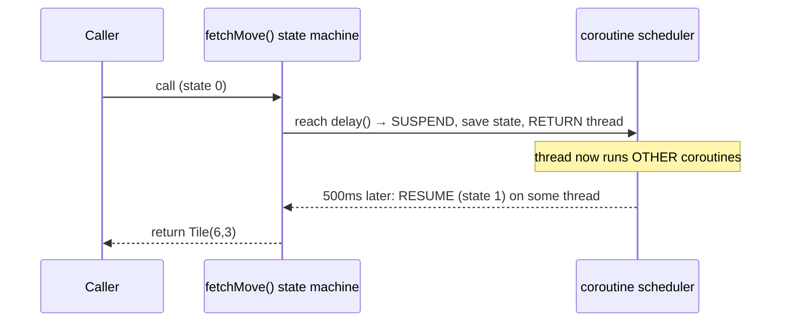
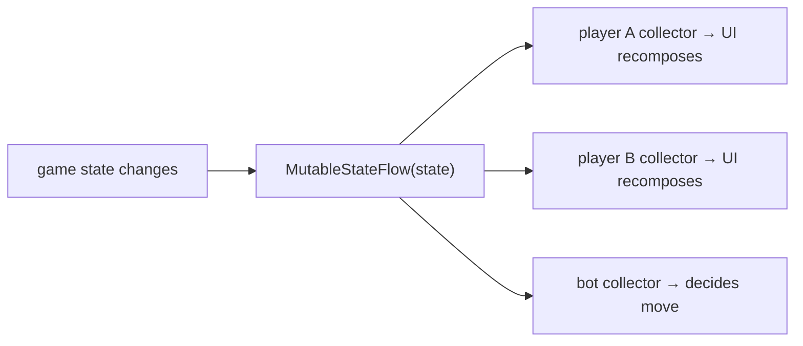

# 05 · Coroutines & Flow

> **Goal:** understand Kotlin's concurrency model — the thing that lets the server handle many
> players on few threads and lets Compose react to changing state. We cover **suspension vs
> blocking**, **structured concurrency**, `launch`/`async`/`Job`, cancellation, and the streaming
> types (`Channel`, `Flow`, `StateFlow`). This directly explains the server's `for (frame in
> incoming)` WebSocket loop.

← [04 · Functions & DSLs](04-functions-lambdas-dsl.md) · next → [06 · Gradle & ecosystem](06-gradle-and-ecosystem.md)

Coroutines are a **library** (`kotlinx.coroutines`) built on one **language** feature: the `suspend`
keyword. Ktor bundles it; to experiment standalone, add `kotlinx-coroutines-core`.

---

## 1. The problem: waiting without wasting a thread

A real-time game spends most of its life **waiting** — for a player's move, a network frame, a timer.
The naive approach dedicates one OS **thread** per waiting task. Threads are expensive (~1 MB of
stack each, OS-scheduled), so a few thousand waiting players would sink the server.

A **coroutine** is a *suspendable computation*: when it hits a waiting point it **suspends** —
releases its thread so other coroutines can run — and **resumes** later on some thread when the wait
is over. Thousands of suspended coroutines can share a handful of threads.

```
BLOCKING (1 thread held while waiting)      SUSPENDING (thread freed while waiting)
  Thread-1: [player A: wait for move.....]    Thread-1: [A starts][B starts][A resumes]...
  Thread-2: [player B: wait for move.....]              ↑ A suspended here, freeing the
  ...one thread stuck per waiter...                       thread for B; resumes when ready
```

> **The core distinction (memorize):** *blocking* keeps a thread occupied and idle. *Suspending*
> frees the thread to do other work and comes back later. Same waiting, vastly better resource use.

---

## 2. `suspend` functions

A function marked **`suspend`** may suspend. It can only be called from another `suspend` function or
from a coroutine builder — this "coloring" is the compiler ensuring suspension only happens where the
machinery exists.

```kotlin
suspend fun fetchMove(): Tile {
    delay(500)          // suspends for 500ms WITHOUT blocking a thread (not Thread.sleep!)
    return Tile.of(6, 3)
}
```

Under the hood (from [Chapter 02](02-kotlin-to-bytecode.md#8-suspend-preview--an-extra-continuation-parameter--a-state-machine)):
the compiler adds a hidden **`Continuation`** parameter and rewrites the body into a **state machine**.
Each suspension point is a state; suspending returns control, and resuming re-enters the method at the
saved state. No thread is parked — it's just a method that can pause and continue.



---

## 3. Coroutine builders: `launch`, `async`, `runBlocking`

You start coroutines with **builders**, inside a **scope** (next section):

- **`launch { }`** — start a coroutine that does work but returns no value. Returns a **`Job`** (a
  handle to cancel/join it). "Fire and manage."
- **`async { }`** — start a coroutine that computes a value. Returns a **`Deferred<T>`**; call
  **`.await()`** (a `suspend` fun) to get the result. Use for concurrent computations.
- **`runBlocking { }`** — the bridge from *ordinary* blocking code into coroutine-land: it **blocks
  the current thread** until the coroutines inside finish. Use it in `main()` and tests, *not* inside
  already-async code.

```kotlin
import kotlinx.coroutines.*

fun main() = runBlocking {              // bridge: blocks main thread until this scope completes
    val job = launch {                  // concurrent, no result
        delay(200); println("move applied")
    }
    val score = async { delay(100); 42 } // concurrent, returns a value
    println("waiting…")                  // prints first
    println("score = ${score.await()}")  // suspends until async is done → 42
    job.join()                           // wait for the launch too
}
// waiting…  /  score = 42  /  move applied
```

---

## 4. Structured concurrency (the safety model)

The rule that makes coroutines *safe*: **every coroutine runs in a `CoroutineScope`, and coroutines
form a parent→child tree with linked lifecycles.** A parent does not complete until all its children
complete; if the parent is cancelled or fails, **all children are cancelled** too. No leaked
"zombie" tasks.

```mermaid
flowchart TB
    Scope["CoroutineScope (e.g. a game Room)"] --> P["parent coroutine"]
    P --> C1["child: read player A frames"]
    P --> C2["child: read player B frames"]
    P --> C3["child: turn timer"]
    P -. "cancel/fail parent" .-> C1
    P -. "→ all children cancelled" .-> C2
    P -. .-> C3
```

Two structured builders you'll use:

- **`coroutineScope { }`** — a `suspend` block that starts children and **waits for all of them**; if
  any child fails, it cancels the siblings and rethrows. "All-or-nothing."
- **`supervisorScope { }`** — like `coroutineScope`, but a failing child does **not** cancel its
  siblings. Ideal for a server game room: if one player's coroutine throws, the others keep playing.

```kotlin
suspend fun playRoom() = supervisorScope {
    launch { handlePlayer("A") }   // if A's coroutine crashes,
    launch { handlePlayer("B") }   // B keeps going (supervisor)
}
```

This is exactly the model to use on the server: a room owns a scope; per-connection coroutines are
its children.

---

## 5. Dispatchers: which thread(s) a coroutine uses

A **dispatcher** decides the thread pool a coroutine runs on (part of its `CoroutineContext`):

| Dispatcher | For | Notes |
|------------|-----|-------|
| `Dispatchers.Default` | CPU-bound work | pool sized to CPU cores |
| `Dispatchers.IO` | blocking I/O (JDBC, files) | large elastic pool; wrap blocking calls here |
| `Dispatchers.Main` | Android UI updates | the single UI thread (Compose/Views) |

Rule: **never do blocking or heavy work on `Main`** (freezes the UI) — offload with
`withContext(Dispatchers.IO) { blockingCall() }`. On the server, wrap JDBC/file calls in
`Dispatchers.IO` so you don't starve the request threads.

---

## 6. Cancellation

Cancellation is **cooperative**: cancelling a `Job` sets a flag; suspension points (`delay`, I/O,
`yield`) check it and throw `CancellationException` to unwind cleanly. A tight CPU loop with no
suspension point won't notice — call `ensureActive()`/`yield()` in such loops. When a WebSocket
disconnects, the coroutine reading it is cancelled, and structured concurrency tears down its
children. This is why clean disconnect handling "just works" if you respect the scope.

---

## 7. Streaming values: `Channel`, `Flow`, `StateFlow`

A `suspend` function returns **one** value. For *streams* of values over time:

- **`Channel<T>`** — a coroutine-safe queue: one coroutine `send`s, another `receive`s. **This is
  exactly what a Ktor WebSocket's `incoming` is** — a `ReceiveChannel<Frame>`. That's why the server
  can write `for (frame in incoming)`: iterating a channel **suspends** until the next frame arrives,
  then resumes. Perfect for a message loop.

  ```kotlin
  // The real server code, now readable as "suspend until next frame, forever":
  for (frame in incoming) {          // suspends here between messages — no thread blocked
      if (frame is Frame.Text) { /* handle move */ }
  }
  ```

- **`Flow<T>`** — a *cold* asynchronous stream (like a lazy, suspendable sequence). Nothing runs until
  someone `collect`s it. Great for "a stream of game states."

  ```kotlin
  fun ticks(): Flow<Int> = flow { var i = 0; while (true) { emit(i++); delay(1000) } }
  // consumer: ticks().collect { println(it) }   // 0,1,2,… one per second
  ```

- **`StateFlow<T>` / `SharedFlow<T>`** — *hot* flows that broadcast to multiple collectors.
  **`StateFlow`** always holds a current value (perfect for "current game state"); Compose can collect
  it and recompose on change. **`SharedFlow`** broadcasts events to many subscribers (perfect for
  fanning a move out to all players in a room).



**How this ties the whole app together:** the server keeps authoritative state and pushes updates via
a `SharedFlow`/`Channel` to each connection; each Android client `collect`s server messages in a
`ViewModel` and exposes a `StateFlow` that **Compose** observes to recompose the UI (next chapter's
Compose section).

---

## Recap

- A coroutine **suspends** (frees its thread) instead of **blocking** it — the key to scaling a
  waiting-heavy server.
- `suspend` compiles to a state machine with a hidden `Continuation`; `delay` ≠ `Thread.sleep`.
- Start coroutines with `launch` (→ `Job`) / `async` (→ `Deferred.await()`); bridge from blocking code
  with `runBlocking`.
- **Structured concurrency**: coroutines form a parent/child tree in a `CoroutineScope`; cancellation
  and failure propagate. `supervisorScope` isolates sibling failures (great for game rooms).
- **Dispatchers** choose threads: `Default` (CPU), `IO` (blocking), `Main` (UI).
- Streams: **`Channel`** (queue — *is* the WebSocket `incoming`), **`Flow`** (cold stream),
  **`StateFlow`/`SharedFlow`** (hot; current-state / broadcast — the app↔server glue).

**Sources:** [coroutines basics](https://kotlinlang.org/docs/coroutines-basics.html),
[composing suspending functions](https://kotlinlang.org/docs/composing-suspending-functions.html),
[coroutine context & dispatchers](https://kotlinlang.org/docs/coroutine-context-and-dispatchers.html),
[cancellation & timeouts](https://kotlinlang.org/docs/cancellation-and-timeouts.html),
[asynchronous Flow](https://kotlinlang.org/docs/flow.html),
[channels](https://kotlinlang.org/docs/channels.html),
[Ktor WebSockets](https://ktor.io/docs/server-websockets.html).

Next: how Gradle turns all this source into runnable artifacts, and how Ktor/Compose are assembled.
→ [06 · Gradle & the build ecosystem](06-gradle-and-ecosystem.md)
