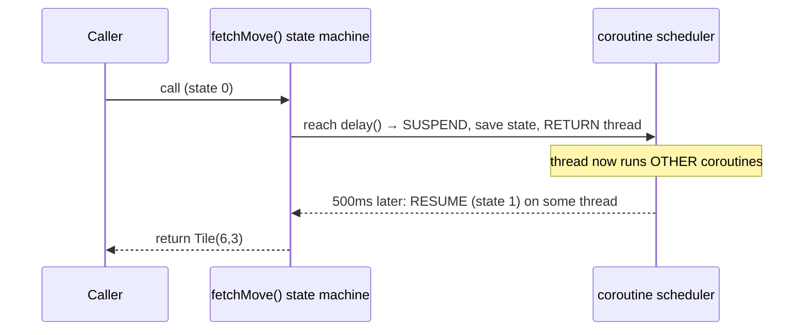
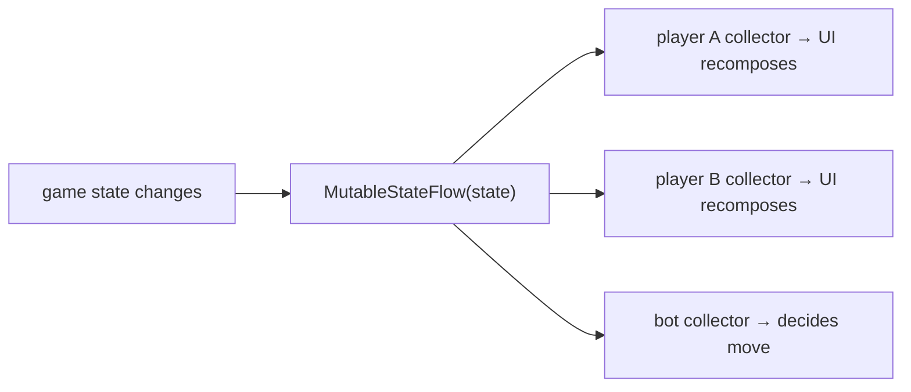

# 05 · Coroutines & Flow

Coroutines are the piece of Kotlin that most directly shapes this project. They're what let one modest
server hold thousands of players on a handful of threads, and they're the machinery under Compose
reacting to changing state. The good news is that the whole subject is built on a single language
feature — the `suspend` keyword — with a library (`kotlinx.coroutines`) layered on top. Ktor bundles
that library; to play with it standalone you'd add `kotlinx-coroutines-core`. We'll start from the
problem coroutines solve, build up through the tools, and end at the streaming types that carry game
state between the server and each client.

← [04 · Functions & DSLs](04-functions-lambdas-dsl.md) · next → [06 · Gradle & ecosystem](06-gradle-and-ecosystem.md)

---

## 1. The problem: waiting without wasting a thread

A real-time game spends almost all of its life *waiting* — for a player to make a move, for a network
frame to arrive, for a timer to fire. The obvious way to handle a waiting task is to give it a thread
and let that thread block until the wait is over. The trouble is that threads are expensive: each one
carries around a megabyte or so of stack and is scheduled by the operating system, so a few thousand
players all sitting idle would sink the server under the weight of threads that are doing nothing but
waiting.

A coroutine is the way out. Think of it as a *suspendable* computation: when it reaches a point where
it has to wait, it *suspends* — it releases its thread so other work can use it — and later, when the
wait is over, it *resumes*, possibly on a different thread. Because a suspended coroutine isn't holding
a thread, thousands of them can share a small pool.

```
BLOCKING (1 thread held while waiting)      SUSPENDING (thread freed while waiting)
  Thread-1: [player A: wait for move.....]    Thread-1: [A starts][B starts][A resumes]...
  Thread-2: [player B: wait for move.....]              ↑ A suspended here, freeing the
  ...one thread stuck per waiter...                       thread for B; resumes when ready
```

The distinction to hold onto is exactly this: *blocking* keeps a thread occupied while it sits idle,
whereas *suspending* frees the thread to do other work and comes back later. The waiting is the same
either way; the resource cost is not remotely the same.

---

## 2. `suspend` functions

A function marked `suspend` is one that's allowed to suspend. The rule that comes with that permission
is that a `suspend` function can only be called from another `suspend` function or from a coroutine
builder — this is the "coloring" you may have heard grumbling about, and it's really the compiler making
sure suspension only happens where the machinery to handle it exists.

```kotlin
suspend fun fetchMove(): Tile {
    delay(500)          // suspends for 500ms WITHOUT blocking a thread (not Thread.sleep!)
    return Tile.of(6, 3)
}
```

You already saw the mechanism in miniature back in
[Chapter 02](02-kotlin-to-bytecode.md#8-suspend-preview--an-extra-continuation-parameter--a-state-machine):
the compiler slips in a hidden `Continuation` parameter and rewrites the body into a state machine.
Each suspension point is a state; suspending hands control back and returns the thread, and resuming
re-enters the method at the state it saved. No thread is parked anywhere — it's genuinely just a method
that can pause and later continue. The `delay(500)` above is the tell: it's not `Thread.sleep`, which
would block; it suspends, and the thread goes off to run something else for those 500 milliseconds.



---

## 3. Coroutine builders: `launch`, `async`, `runBlocking`

You don't call a `suspend` function out of thin air; you start a coroutine with a *builder*, inside a
*scope* (which the next section covers). Three builders cover almost everything. `launch { }` starts a
coroutine that does work but produces no value, and hands you back a `Job` — a handle you can use to
cancel or wait on it; think of it as "fire and manage." `async { }` starts a coroutine that computes a
value and hands you a `Deferred<T>`, whose `.await()` (itself a `suspend` function) gives you the
result once it's ready; that's the tool for running computations concurrently. And `runBlocking { }` is
the bridge from ordinary blocking code into coroutine-land: it blocks the current thread until
everything inside finishes, which is exactly what you want in `main()` or a test and exactly what you
don't want inside code that's already asynchronous.

Seeing them interact makes the timing concrete:

```kotlin
import kotlinx.coroutines.*

fun main() = runBlocking {              // bridge: blocks main thread until this scope completes
    val job = launch {                  // concurrent, no result
        delay(200); println("move applied")
    }
    val score = async { delay(100); 42 } // concurrent, returns a value
    println("waiting…")                  // prints first
    println("score = ${score.await()}")  // suspends until async is done → 42
    job.join()                           // wait for the launch too
}
// waiting…  /  score = 42  /  move applied
```

---

## 4. Structured concurrency (the safety model)

The idea that makes coroutines *safe* rather than a new way to leak background tasks is structured
concurrency. Every coroutine runs inside a `CoroutineScope`, and coroutines form a parent-and-child
tree with linked lifetimes. A parent doesn't consider itself finished until all its children have
finished, and if the parent is cancelled or fails, all of its children are cancelled with it. There are
no orphaned "zombie" tasks quietly running after the thing that started them is gone.

```mermaid
flowchart TB
    Scope["CoroutineScope (e.g. a game Room)"] --> P["parent coroutine"]
    P --> C1["child: read player A frames"]
    P --> C2["child: read player B frames"]
    P --> C3["child: turn timer"]
    P -. "cancel/fail parent" .-> C1
    P -. "→ all children cancelled" .-> C2
    P -. .-> C3
```

Two builders put this to work, and the difference between them matters for a game server. `coroutineScope { }`
is a `suspend` block that launches children and waits for all of them; if any child fails, it cancels
the siblings and rethrows — all-or-nothing. `supervisorScope { }` is the same shape, except a failing
child does *not* drag its siblings down. That second one is the right model for a room full of players:
if one player's coroutine throws, you want the others to keep playing rather than have the whole room
collapse.

```kotlin
suspend fun playRoom() = supervisorScope {
    launch { handlePlayer("A") }   // if A's coroutine crashes,
    launch { handlePlayer("B") }   // B keeps going (supervisor)
}
```

This is precisely the arrangement to reach for on the server: a room owns a scope, and each connection's
coroutine is one of that scope's children.

---

## 5. Dispatchers: which thread(s) a coroutine uses

A coroutine still has to run on a real thread eventually, and a *dispatcher* decides which pool of
threads that is — it's part of the coroutine's context. Three cover the common cases:

| Dispatcher | For | Notes |
|------------|-----|-------|
| `Dispatchers.Default` | CPU-bound work | pool sized to CPU cores |
| `Dispatchers.IO` | blocking I/O (JDBC, files) | large elastic pool; wrap blocking calls here |
| `Dispatchers.Main` | Android UI updates | the single UI thread (Compose/Views) |

The rule that keeps you out of trouble is to never do blocking or heavy work on `Main`, because that's
the one thread drawing the UI and blocking it freezes the app. When you must make a blocking call,
push it off with `withContext(Dispatchers.IO) { blockingCall() }`. The same instinct applies on the
server: wrap JDBC or file calls in `Dispatchers.IO` so they don't starve the threads handling requests.

---

## 6. Cancellation

Cancellation in coroutines is *cooperative*, which is worth understanding because it explains a common
surprise. Cancelling a `Job` doesn't forcibly kill anything; it sets a flag, and the suspension points
— `delay`, I/O, `yield` — check that flag and throw a `CancellationException` to unwind cleanly. The
consequence is that a tight CPU loop with no suspension point in it won't notice it's been cancelled at
all, so in such a loop you call `ensureActive()` or `yield()` to give cancellation a chance to land.
The payoff is that when a WebSocket disconnects and the coroutine reading it is cancelled, structured
concurrency tears down its children automatically — which is why clean disconnect handling "just works"
as long as you've respected the scope.

---

## 7. Streaming values: `Channel`, `Flow`, `StateFlow`

A `suspend` function returns a single value. Games are made of *streams* of values over time — moves,
state updates, events — so we need types for that, and there are three worth knowing, escalating from a
plain queue up to the reactive state that drives the UI.

The simplest is `Channel<T>`, a coroutine-safe queue: one coroutine `send`s, another `receive`s. This
one isn't abstract for us at all, because a Ktor WebSocket's `incoming` *is* a `ReceiveChannel<Frame>`.
That's the whole reason the server can be written as `for (frame in incoming)` — iterating a channel
suspends until the next frame arrives, then resumes with it, which is exactly the message loop you want:

```kotlin
// The real server code, now readable as "suspend until next frame, forever":
for (frame in incoming) {          // suspends here between messages — no thread blocked
    if (frame is Frame.Text) { /* handle move */ }
}
```

Next up is `Flow<T>`, a *cold* asynchronous stream — think of it as a lazy, suspendable sequence.
Nothing runs until someone `collect`s it, and each collector starts it afresh. It's the natural type
for "a stream of game states" that a consumer pulls on demand:

```kotlin
fun ticks(): Flow<Int> = flow { var i = 0; while (true) { emit(i++); delay(1000) } }
// consumer: ticks().collect { println(it) }   // 0,1,2,… one per second
```

At the top of the escalation are the *hot* flows, which broadcast to multiple collectors at once.
`StateFlow<T>` always holds a current value, which makes it the perfect home for "the current game
state" — Compose can collect it and recompose whenever it changes. `SharedFlow<T>` broadcasts events to
many subscribers without holding a single current value, which is what you want for fanning a move out
to every player in a room.



Put those three together and you can see the whole app's nervous system. The server holds the
authoritative state and pushes updates out through a `SharedFlow` or `Channel` to each connection; each
Android client `collect`s the server's messages inside a `ViewModel` and re-exposes them as a
`StateFlow`; and Compose observes that `StateFlow` and redraws the UI when it changes — which is exactly
where the next chapter's Compose section picks up.

---

Coroutines come down to one move made over and over: a coroutine *suspends* to free its thread instead
of *blocking* it, which is the whole reason a waiting-heavy server can scale. Underneath, `suspend`
compiles to a state machine with a hidden `Continuation`, and `delay` is not `Thread.sleep`. You start
coroutines with `launch` (giving a `Job`) or `async` (giving a `Deferred` you `await`), and bridge in
from blocking code with `runBlocking`. Structured concurrency ties coroutines into a scope-rooted tree
so cancellation and failure propagate cleanly, with `supervisorScope` isolating sibling failures for a
game room. Dispatchers pick the threads — `Default`, `IO`, `Main` — and the streaming types climb from
`Channel` (which *is* the WebSocket `incoming`) through cold `Flow` to hot `StateFlow`/`SharedFlow`, the
glue between server and app. Next we look at how Gradle assembles all of this into something runnable,
and how Ktor and Compose are put together.
→ [06 · Gradle & the build ecosystem](06-gradle-and-ecosystem.md)

*Further reading: [coroutines basics](https://kotlinlang.org/docs/coroutines-basics.html),
[composing suspending functions](https://kotlinlang.org/docs/composing-suspending-functions.html),
[context & dispatchers](https://kotlinlang.org/docs/coroutine-context-and-dispatchers.html),
[cancellation & timeouts](https://kotlinlang.org/docs/cancellation-and-timeouts.html),
[asynchronous Flow](https://kotlinlang.org/docs/flow.html),
[channels](https://kotlinlang.org/docs/channels.html), and
[Ktor WebSockets](https://ktor.io/docs/server-websockets.html).*
