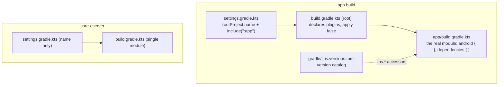
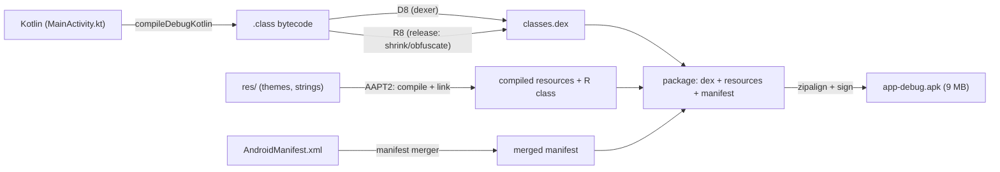
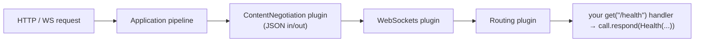
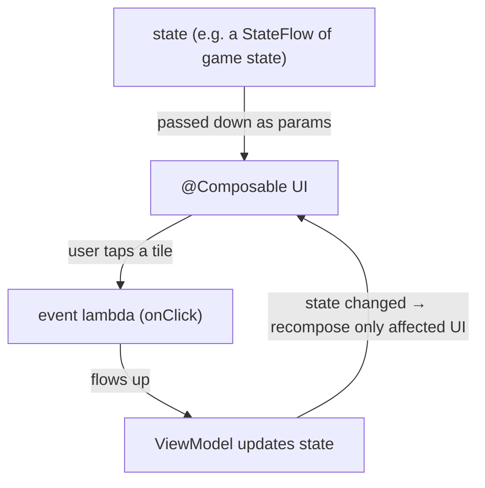

# 06 · Gradle & the build ecosystem

> **Goal:** understand the machine that turns your source into runnable artifacts and pulls in every
> library — Gradle. Then see the two framework "shapes" you build on: the **AGP → APK** pipeline for
> Android, and how **Ktor** and **Compose** are assembled. After this, every line of the three
> `build.gradle.kts` files is legible.

← [05 · Coroutines & Flow](05-coroutines-and-flow.md) · [Course home](README.md)

---

## 1. What Gradle is (and the npm/pip analogy)

**Gradle** is a build tool: it compiles your code, runs tests, packages artifacts (a `.jar` or an
`.apk`), and — the part you feel most — **downloads your dependencies**. There is no separate "Kotlin
package manager"; Gradle *is* it.

| You know | Here |
|----------|------|
| `package.json` declares deps | `build.gradle.kts` declares deps |
| `npm install` fetches them | `./gradlew build` fetches + builds |
| npm registry | Maven repositories (Maven Central, Google's Maven) |
| `"react": "^18"` | `"io.ktor:ktor-server-core:3.0.3"` |
| `npm run <script>` | `./gradlew <task>` |

Build scripts are written **in Kotlin** (`.gradle.kts` = "Gradle Kotlin script"), so the same
language configures the build. That's why you see `plugins { }`, `dependencies { }`,
`repositories { }` — each is a lambda-with-receiver block ([Chapter 04](04-functions-lambdas-dsl.md)):
`dependencies { implementation(...) }` means "on the dependencies handler, call `implementation(...)`."

---

## 2. The project model: settings, root, modules

A Gradle **build** has a `settings.gradle.kts` (names the build and lists its modules) and one
`build.gradle.kts` per module.



- `core` and `server` are **single-module** builds: one `settings.gradle.kts` (just the
  name) + one `build.gradle.kts`.
- `app` is **multi-part**: `settings.gradle.kts` does `include(":app")`, the **root**
  `build.gradle.kts` only *declares* plugins (`apply false` = "make available, don't apply here"), and
  **`app/build.gradle.kts`** is the actual application module. This is the standard Android layout.

**The build lifecycle** runs in three phases every time:

1. **Initialization** — read `settings.gradle.kts`, figure out which modules exist.
2. **Configuration** — execute every `build.gradle.kts` top-to-bottom to build the *task graph* (it
   runs your Kotlin config code, but not the work yet).
3. **Execution** — run the requested tasks (`compileKotlin`, `test`, `assembleDebug`…) in dependency
   order.

That's why a `build.gradle.kts` is *code that describes a build*, not the build itself.

---

## 3. Dependencies: coordinates, repositories, configurations

A dependency is named by **coordinates** `group:name:version` and fetched from a **repository**:

```kotlin
repositories { mavenCentral() }                       // WHERE to download from
dependencies {
    implementation("io.ktor:ktor-server-core:3.0.3")  // group : name : version
}
```

The word before the coordinate — `implementation`, `api`, etc. — is the **configuration**: it says
*how* the dependency is used and *who else* sees it.

| Configuration | Needed to compile your code? | Visible to consumers of your module? | Use for |
|---------------|:---:|:---:|---------|
| `implementation` | ✅ | ❌ (hidden) | most deps — keeps your API surface small, speeds builds |
| `api` | ✅ | ✅ (leaks through) | a dep whose types appear in **your** public API |
| `compileOnly` | ✅ (compile only) | ❌ | provided at runtime by the host (annotations) |
| `runtimeOnly` | ❌ | runtime only | drivers/backends (e.g. `logback-classic`) |
| `testImplementation` | ✅ tests only | ❌ | JUnit, `ktor-server-test-host` |
| `debugImplementation` | ✅ debug builds | ❌ (Android) | tooling like Compose `ui-tooling` |

Prefer **`implementation`** by default; reach for `api` only when your module's public functions
return/accept a dependency's types. This is why the server declares `logback-classic` as a runtime
concern and JUnit as `testImplementation`.

### BOM / `platform` — versions that must agree

Some libraries ship as a family that must share one version (all of Compose, all of Ktor). A **BOM**
(Bill of Materials) is a special dependency that only *declares versions*. You import it with
`platform(...)` and then list the family members **without versions** — the BOM decides them:

```kotlin
implementation(platform(libs.androidx.compose.bom)) // the BOM pins the whole Compose family
implementation(libs.androidx.ui)                     // no version here — comes from the BOM
implementation(libs.androidx.material3)              // ditto
```

That's exactly the pattern in `app/build.gradle.kts`. One number to bump, guaranteed-compatible set.

---

## 4. Version catalogs and the wrapper

**Version catalog** (`gradle/libs.versions.toml`) centralizes versions and library names; Gradle
generates **type-safe accessors** (`libs.androidx.core.ktx`) you use in the script. Dashes in the TOML
name become dots in code (`androidx-core-ktx` → `libs.androidx.core.ktx`). One source of truth for
every version; the alias is checked at build-configuration time, so typos fail fast.

**The wrapper** (`gradlew`, `gradlew.bat`, `gradle/wrapper/*`) pins the exact Gradle version per repo
and downloads it on first use. Always run **`./gradlew`**, never a global `gradle`, so everyone builds
with the same Gradle. (Core & server pin 8.11.1; android pins 8.9 to match AGP 8.5.2 —
see the project's `CLAUDE.md`.)

---

## 5. The AGP → APK pipeline

Building the Android app runs far more than "compile Kotlin." The **Android Gradle Plugin (AGP)** adds
a long chain of steps that turns Kotlin + resources + manifest into an installable, signed **APK**:



Each numbered gradle task you saw scroll by during `./gradlew assembleDebug` maps to a box here:
`compileDebugKotlin`, `mergeDebugResources`, `processDebugManifest`, `dexBuilderDebug`,
`packageDebug`, `validateSigningDebug`. Two you should remember:

- **D8** converts JVM bytecode → **DEX** (the format ART runs, [Chapter 01](01-jvm-and-bytecode.md#5-the-android-twist-dex-and-art)).
- **R8** (release builds) **shrinks and obfuscates** — removes unused code, renames symbols. It's off
  now (`isMinifyEnabled = false`); you'll turn it on before shipping, guided by `proguard-rules.pro`.

Debug builds are auto-signed with a debug key (why `validateSigningDebug` runs). Release needs your
own keystore — a later task.

---

## 6. How Ktor is assembled (server architecture)

Ktor is a **pipeline of plugins**. An `Application` processes each request through an ordered pipeline;
**plugins** (installed with `install(X) { }`) hook into that pipeline to add behavior; **routing** is
itself a plugin that dispatches by path/method.



That's precisely the structure of `Application.module()`: `install(ContentNegotiation) { json() }`
and `install(WebSockets)` add plugins; `routing { get("/health") { ... } }` registers handlers. The
engine (**Netty**) is the component that actually opens the TCP socket and feeds the pipeline. Full
line-by-line coverage lives in the (private) walkthrough chapters.

---

## 7. How Compose is assembled (client architecture)

Jetpack Compose is three cooperating pieces:

1. **The Compose compiler plugin** (`org.jetbrains.kotlin.plugin.compose`) — transforms every
   `@Composable` function so it participates in recomposition (it threads a hidden `Composer` through,
   much like `suspend` threads a `Continuation`).
2. **The Compose runtime** — manages **state** and **recomposition**: it tracks which composables read
   which state and re-invokes only those when the state changes.
3. **Compose UI + Material 3** — the actual widgets (`Text`, `Column`, `Scaffold`) and theme.

The mental model (Google's "Thinking in Compose"): **UI is a function of state.** State flows **down**
as parameters; events flow **up** as lambdas; when state changes, affected composables **recompose**
(re-run). Composables must be **fast, idempotent, side-effect-free** because the runtime may skip,
reorder, or repeat them.



This is why [Chapter 05](05-coroutines-and-flow.md)'s `StateFlow` matters: the client collects server
messages into a `StateFlow`, Compose observes it, and the UI recomposes.

---

## Recap

- Gradle = build tool + dependency manager (Kotlin's "npm"). Scripts are Kotlin
  (lambda-with-receiver blocks). Lifecycle: **init → configure → execute.**
- Dependencies are `group:name:version` from repositories; the **configuration**
  (`implementation`/`api`/`runtimeOnly`/`testImplementation`/`debugImplementation`) controls
  compile-need and visibility. Prefer `implementation`.
- **BOM + `platform`** pin a whole library family to one version (Compose, Ktor). **Version catalogs**
  centralize versions into `libs.*`. The **wrapper** pins Gradle itself.
- **AGP** adds the Android chain: compile → merge resources/manifest → **D8** (DEX) → **R8** (shrink) →
  package → sign → **APK**.
- **Ktor** = an application **pipeline** + **plugins** (`install`) + **routing**, driven by an engine
  (Netty). **Compose** = compiler plugin + runtime + UI, with **state down / events up / recompose**.

**Sources:** [Gradle: dependency management](https://docs.gradle.org/current/userguide/dependency_management.html),
[declaring dependencies / configurations](https://docs.gradle.org/current/userguide/declaring_dependencies.html),
[platform/BOM](https://docs.gradle.org/current/userguide/platforms.html),
[version catalogs](https://docs.gradle.org/current/userguide/platforms.html#sub:version-catalog),
[Android build overview](https://developer.android.com/build) & [shrink/R8](https://developer.android.com/build/shrink-code),
[Ktor: plugins](https://ktor.io/docs/server-plugins.html) & [routing](https://ktor.io/docs/server-routing.html),
[Compose mental model](https://developer.android.com/develop/ui/compose/mental-model).

That's the ecosystem, end to end. Now apply it to your own code — open any `.kt` file and read it the
way these chapters read Kotlin.

← [Course home](README.md)
