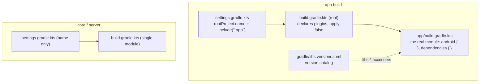
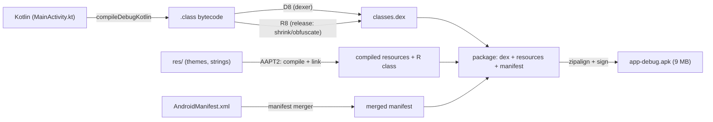
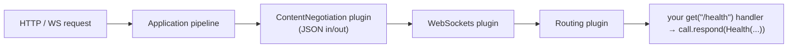
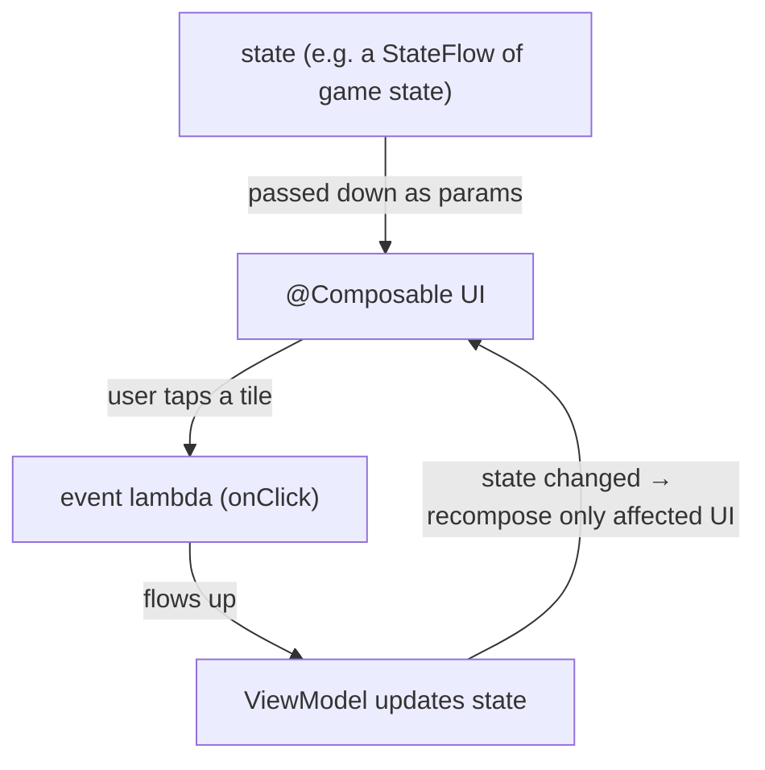

# 06 · Gradle & the build ecosystem

Every other chapter has been about the code. This one is about the machine that turns that code into
something you can run and pulls in every library it leans on — Gradle — and then about the two framework
"shapes" you build on top of it: the AGP pipeline that produces an Android APK, and the way Ktor and
Compose are actually assembled. The goal is concrete: by the end, every line in the three
`build.gradle.kts` files should read as a decision you understand rather than an incantation you copied.

← [05 · Coroutines & Flow](05-coroutines-and-flow.md) · [Course home](README.md)

---

## 1. What Gradle is (and the npm/pip analogy)

Gradle is a build tool: it compiles your code, runs your tests, packages the result into a `.jar` or an
`.apk`, and — the part you feel most often — downloads your dependencies. There's no separate "Kotlin
package manager" sitting alongside it; Gradle is the package manager too. If you've used npm, the whole
thing maps over cleanly:

| You know | Here |
|----------|------|
| `package.json` declares deps | `build.gradle.kts` declares deps |
| `npm install` fetches them | `./gradlew build` fetches + builds |
| npm registry | Maven repositories (Maven Central, Google's Maven) |
| `"react": "^18"` | `"io.ktor:ktor-server-core:3.0.3"` |
| `npm run <script>` | `./gradlew <task>` |

The one twist that surprises people from the npm world is that the build script itself is written in
Kotlin — a `.gradle.kts` file is a "Gradle Kotlin script." That's why it's full of blocks like
`plugins { }`, `dependencies { }`, and `repositories { }`: each is a lambda with receiver, exactly the
construct from [Chapter 04](04-functions-lambdas-dsl.md). When you write
`dependencies { implementation(...) }`, you're saying "on the dependencies handler, call
`implementation(...)`," the same `menu { item(...) }` shape you built by hand.

---

## 2. The project model: settings, root, modules

A Gradle *build* is made of a `settings.gradle.kts`, which names the build and lists its modules, plus
one `build.gradle.kts` per module. The three repos here show the two arrangements you'll meet.



`core` and `server` are the simple case — single-module builds, each with one `settings.gradle.kts`
that does little more than give the build a name, and one `build.gradle.kts`. The `app` is the more
elaborate, standard-Android layout: its `settings.gradle.kts` does `include(":app")`, the *root*
`build.gradle.kts` only *declares* plugins with `apply false` (meaning "make these available to
submodules, but don't apply them here"), and the real configuration lives in `app/build.gradle.kts`.

It's worth knowing that every build runs in three phases, because it explains why a build script is
"code that describes a build" rather than the build itself. First is *initialization*, where Gradle
reads `settings.gradle.kts` and works out which modules exist. Then *configuration*, where it executes
every `build.gradle.kts` top to bottom to assemble the task graph — this runs your Kotlin config code,
but not the actual work yet. Only in the third phase, *execution*, does it run the tasks you asked for
(`compileKotlin`, `test`, `assembleDebug`) in dependency order. So when your build script says
`implementation(...)`, that line runs during configuration to *describe* a dependency; the download and
compile happen later.

---

## 3. Dependencies: coordinates, repositories, configurations

A dependency has *coordinates* of the form `group:name:version`, and it's fetched from a *repository*:

```kotlin
repositories { mavenCentral() }                       // WHERE to download from
dependencies {
    implementation("io.ktor:ktor-server-core:3.0.3")  // group : name : version
}
```

The word in front of the coordinate — `implementation`, `api`, and the rest — is the *configuration*,
and it answers two questions at once: is this dependency needed to compile your code, and does anyone
who depends on *your* module get to see it? Those two axes are the whole story, and the table lays out
the combinations you'll actually use:

| Configuration | Needed to compile your code? | Visible to consumers of your module? | Use for |
|---------------|:---:|:---:|---------|
| `implementation` | ✅ | ❌ (hidden) | most deps — keeps your API surface small, speeds builds |
| `api` | ✅ | ✅ (leaks through) | a dep whose types appear in **your** public API |
| `compileOnly` | ✅ (compile only) | ❌ | provided at runtime by the host (annotations) |
| `runtimeOnly` | ❌ | runtime only | drivers/backends (e.g. `logback-classic`) |
| `testImplementation` | ✅ tests only | ❌ | JUnit, `ktor-server-test-host` |
| `debugImplementation` | ✅ debug builds | ❌ (Android) | tooling like Compose `ui-tooling` |

The habit to form is to default to `implementation` and only reach for `api` when your module's public
functions actually return or accept a dependency's types — otherwise you're leaking your internals into
everyone who uses you and slowing their builds. This is exactly the reasoning behind the server
declaring `logback-classic` as a runtime-only concern and JUnit as `testImplementation`: neither belongs
in the compile-time public surface.

### BOM / `platform` — versions that must agree

Some libraries ship as a whole family that has to move in lockstep — every Compose artifact at one
version, every Ktor artifact at another. A *BOM* (Bill of Materials) is a special dependency that
declares nothing but versions. You bring it in with `platform(...)` and then list the family members
*without* versions, letting the BOM decide them:

```kotlin
implementation(platform(libs.androidx.compose.bom)) // the BOM pins the whole Compose family
implementation(libs.androidx.ui)                     // no version here — comes from the BOM
implementation(libs.androidx.material3)              // ditto
```

That's precisely the pattern in `app/build.gradle.kts`: one number to bump when you upgrade, and a set
of artifacts guaranteed to be compatible with each other.

---

## 4. Version catalogs and the wrapper

Two more pieces of build hygiene are worth knowing because they show up all over the Android repo. A
*version catalog* (`gradle/libs.versions.toml`) centralizes your versions and library names in one
file, and Gradle generates type-safe accessors like `libs.androidx.core.ktx` from it — dashes in the
TOML name become dots in code, so `androidx-core-ktx` is `libs.androidx.core.ktx`. Because the alias is
checked at configuration time, a typo fails the build immediately instead of pulling a wrong artifact.

The *wrapper* — the `gradlew` script, its `.bat` sibling, and the files under `gradle/wrapper/` — pins
the exact Gradle version for the repo and downloads it on first use. The rule that follows is to always
run `./gradlew` rather than a globally installed `gradle`, so everyone builds with the same Gradle
regardless of what's on their machine. (Concretely, `core` and `server` pin 8.11.1 while `android` pins
8.9 to line up with AGP 8.5.2 — the compatibility set recorded in the project's `CLAUDE.md`.)

---

## 5. The AGP → APK pipeline

Building the Android app is far more than "compile Kotlin." The Android Gradle Plugin (AGP) bolts on a
long chain of steps that takes Kotlin, resources, and a manifest and turns them into an installable,
signed APK:



Each task you watched scroll past during `./gradlew assembleDebug` — `compileDebugKotlin`,
`mergeDebugResources`, `processDebugManifest`, `dexBuilderDebug`, `packageDebug`, `validateSigningDebug`
— is one box on that diagram. Two of them are worth committing to memory. D8 is the dexer that converts
JVM bytecode into DEX, the format ART runs, which is the Android twist from
[Chapter 01](01-jvm-and-bytecode.md#5-the-android-twist-dex-and-art). R8, which runs on release builds,
shrinks and obfuscates — stripping unused code and renaming symbols; it's currently off
(`isMinifyEnabled = false`), and you'll switch it on before shipping, tuned by `proguard-rules.pro`.
Debug builds are auto-signed with a debug key, which is why `validateSigningDebug` runs at all; a
release build needs your own keystore, a task for later.

---

## 6. How Ktor is assembled (server architecture)

Ktor's whole architecture is a *pipeline of plugins*. An `Application` runs each incoming request
through an ordered pipeline; *plugins*, installed with `install(X) { }`, hook into that pipeline to add
behavior; and *routing* is itself just a plugin — one that dispatches by path and method.



That diagram is a picture of `Application.module()` in the server: `install(ContentNegotiation) { json() }`
and `install(WebSockets)` add plugins to the pipeline, and `routing { get("/health") { ... } }`
registers handlers on the routing plugin. Underneath it all, the engine — Netty — is the component that
actually opens the TCP socket and feeds bytes into the pipeline. The full line-by-line reading of this
file lives in the private walkthrough chapters, but the shape is already legible from here.

---

## 7. How Compose is assembled (client architecture)

Jetpack Compose is really three cooperating pieces. There's the Compose *compiler plugin*
(`org.jetbrains.kotlin.plugin.compose`), which rewrites every `@Composable` function so it can take part
in recomposition — threading a hidden `Composer` through, much the way `suspend` threads a
`Continuation`. There's the Compose *runtime*, which manages state and recomposition by tracking which
composables read which state and re-invoking only those when the state changes. And there's Compose *UI*
plus *Material 3*, the actual widgets — `Text`, `Column`, `Scaffold` — and the theming.

The mental model Google reaches for, "Thinking in Compose," is that the UI is a function of state. State
flows *down* as parameters; events flow *up* as lambdas; and when state changes, the affected
composables *recompose* — they re-run. Because the runtime is free to skip, reorder, or repeat them,
composables have to be fast, idempotent, and free of side effects.



This is where [Chapter 05](05-coroutines-and-flow.md)'s `StateFlow` earns its keep: the client collects
the server's messages into a `StateFlow`, Compose observes it, and the UI recomposes when the state
moves — the state-down, events-up loop drawn above.

---

Pulling the ecosystem together: Gradle is Kotlin's build tool and package manager rolled into one, its
scripts are lambda-with-receiver Kotlin, and it runs in three phases — initialize, configure, execute.
Dependencies are `group:name:version` fetched from repositories, and the configuration you declare them
under (`implementation`, `api`, `runtimeOnly`, `testImplementation`, `debugImplementation`) governs both
compile-need and visibility, with `implementation` the sensible default. A BOM plus `platform` pins a
whole library family to one version, version catalogs centralize versions into `libs.*`, and the wrapper
pins Gradle itself. AGP adds the Android chain — compile, merge resources and manifest, D8 to DEX, R8 to
shrink, package, sign, APK. And the two frameworks each have a clean shape: Ktor is a pipeline of
plugins plus routing driven by Netty, and Compose is a compiler plugin plus runtime plus UI, running on
state-down, events-up, recompose. From here the move is to apply all of it to your own code — open any
`.kt` file and read it the way these chapters read Kotlin.

← [Course home](README.md)

*Further reading: [Gradle dependency management](https://docs.gradle.org/current/userguide/dependency_management.html),
[declaring dependencies & configurations](https://docs.gradle.org/current/userguide/declaring_dependencies.html),
[platforms & BOMs](https://docs.gradle.org/current/userguide/platforms.html),
[version catalogs](https://docs.gradle.org/current/userguide/platforms.html#sub:version-catalog),
[the Android build overview](https://developer.android.com/build) and [R8 shrinking](https://developer.android.com/build/shrink-code),
[Ktor plugins](https://ktor.io/docs/server-plugins.html) and [routing](https://ktor.io/docs/server-routing.html),
and the [Compose mental model](https://developer.android.com/develop/ui/compose/mental-model).*
