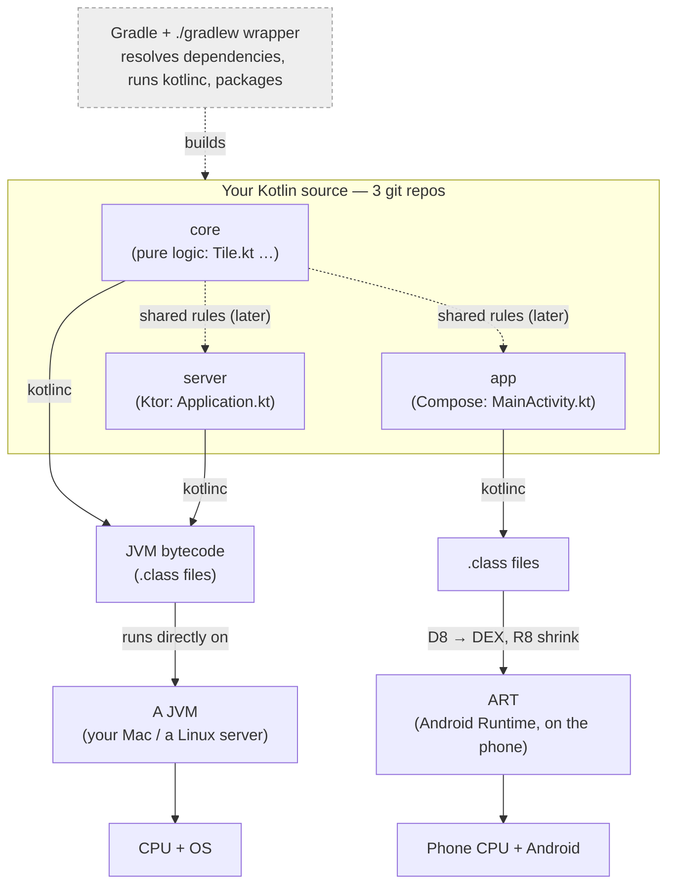

# Kotlin, from the JVM up — the course

Most Kotlin tutorials teach you to write Kotlin. This one is built to let you *read* it — to open any
file in a real three-module app, put your finger on any line, and say what it does and roughly what it
compiles to. The app is small but real: a shared, pure-Kotlin `core`, a Ktor `server`, and a Compose
`app`. By the end you should be able to work on all three without any line feeling like magic.

It's written for someone who can already program. If you know JavaScript and Node, and you've written
Python, you don't need another explanation of what a variable is — so you won't get one. What you'll
get instead is the machinery that's genuinely new coming from those languages: the JVM your code
actually runs on, Kotlin's type system, coroutines, lambda-with-receiver, and the build tools that
turn source into something you can run. Those are the things that make this project's code look like
sorcery until you've seen how they work, at which point they stop being sorcery.

A note on trust: everything here is checked, not asserted. Snippets marked "REPL" paste straight into
the `kotlin` shell and produce the output shown. Every bytecode listing in Chapter 02 came out of
`javap` run on the project's own compiled classes — you can reproduce all of it. Where the course
makes a claim about how a language feature behaves, it's grounded in the official docs
(kotlinlang.org, ktor.io, developer.android.com, docs.gradle.org), linked at the point the claim is
made.

## The one diagram to hold in your head

Before any detail, it helps to have the whole shape in your head: three repos of Kotlin source, one
compiler, two runtimes (an ordinary JVM for `core` and `server`; Android's ART for the `app`), and
Gradle driving the whole thing.



Three ideas are worth pulling out of that picture, because most early confusion traces back to one of
them. First, Kotlin is a *language* and the JVM (or Android's ART) is a *runtime* — two different
things. Kotlin compiles to the very same bytecode Java produces, which is why it quietly inherits the
entire Java ecosystem: Ktor, Netty, the Android SDK, and JUnit are all just libraries on that runtime.
Second, `core` is kept pure Kotlin on purpose — no Android, no Ktor — so the exact same logic can run
on the server today and inside the app later, same source and same behavior on both sides. Third,
Gradle is the thing that turns source into runnable artifacts and downloads every library; it isn't a
language feature at all, it's closer to "npm plus webpack plus make" wearing one hat.

## How to use this course

Read the chapters in order the first time through — each leans on the one before it. After that, treat
it as a reference and jump to whatever you need. Every concept is tied to real code you can run, so the
best way to read is with a terminal open beside you.

Three tools earn their keep the whole way through:

```bash
kotlin                       # the REPL: paste snippets, see results. Ctrl+D to quit.
kotlinc file.kt -d out.jar   # compile ahead-of-time (used when we inspect bytecode)
javap -c -p SomeClass.class  # DISASSEMBLE: show the real bytecode a construct became
```

Anything marked "REPL" is meant to be pasted and run. And every bytecode listing in Chapter 02 was
produced by running `javap` on compiled project code, so when a chapter says "this is what it becomes,"
you can check it for yourself rather than take the course's word.

A few terms get used from the first page, so here they are once, plainly. To *compile* is to translate
your source into another form — here, bytecode. *Bytecode* is a compact, CPU-independent instruction
set. A *runtime* is the program that executes your compiled code (the JVM). A *dependency* is an
external library your code pulls in. And *Gradle* is the build tool that compiles the code and fetches
those dependencies. Each of these gets its own proper treatment in the chapter where it matters.

## Course map

| # | Chapter | What you walk away understanding |
|---|---------|----------------------------------|
| 00 | **This page** | The whole-stack mental model; how to run everything. |
| 01 | [The JVM & bytecode](01-jvm-and-bytecode.md) | What actually runs your code: bytecode, the JVM's memory, class loading, JIT, GC — and the Android (DEX/ART) variant. |
| 02 | [Kotlin → bytecode (all angles)](02-kotlin-to-bytecode.md) | What each Kotlin construct *becomes* (`data class`, `object`, extension fun, default args…), shown with real `javap` output from `Tile.class`. |
| 03 | [Language core & the type system](03-language-core.md) | `val`/`var`, `Any`/`Unit`/`Nothing`, null safety in full, scope functions, classes, `sealed`/`enum`/`data`, generics & variance. |
| 04 | [Functions, lambdas & building a DSL](04-functions-lambdas-dsl.md) | Function types, closures, `inline`/`reified`, and lambda-with-receiver — the one idea behind every `{ }` block in Ktor and Compose. |
| 05 | [Coroutines & Flow](05-coroutines-and-flow.md) | Suspension vs blocking, structured concurrency, `Job`/`async`, `Channel`/`Flow`/`StateFlow` — the engine under the server's WebSocket loop and under Compose. |
| 06 | [Gradle & the build ecosystem](06-gradle-and-ecosystem.md) | The build model, `implementation` vs `api`, BOM/`platform`, version catalogs, the AGP APK pipeline, Ktor's & Compose's architecture. |

Chapters 07–09 take everything above and walk the real codebase with it, line by line — `Tile.kt`,
`Application.kt`, `MainActivity.kt`. They live in a separate private repo because they follow an
in-progress product, but the six public chapters here teach every concept those walkthroughs use, so
you can read your own code exactly the same way.

If you want a rhythm to pace yourself: the first sitting is 00 → 01 → 02, which leaves you understanding
what actually runs and what your Kotlin turns into. The second is 03 → 04, after which most Kotlin
anywhere is readable. The third is 05 → 06, the two systems — concurrency and the build — that make the
project tick. Then the real exercise begins: open any `.kt` file, point at a line, and name what it
does and roughly what it compiles to. When that's easy, the course has done its job.

---

*Grounded in: [kotlinlang.org/docs](https://kotlinlang.org/docs/home.html),
[ktor.io/docs](https://ktor.io/docs/welcome.html),
[developer.android.com](https://developer.android.com/develop/ui/compose/documentation),
[docs.gradle.org](https://docs.gradle.org/current/userguide/userguide.html). Secondary reference:
*Kotlin in Action, 2nd ed.* (Manning) and the [Kotlin language specification](https://kotlinlang.org/spec/).*
