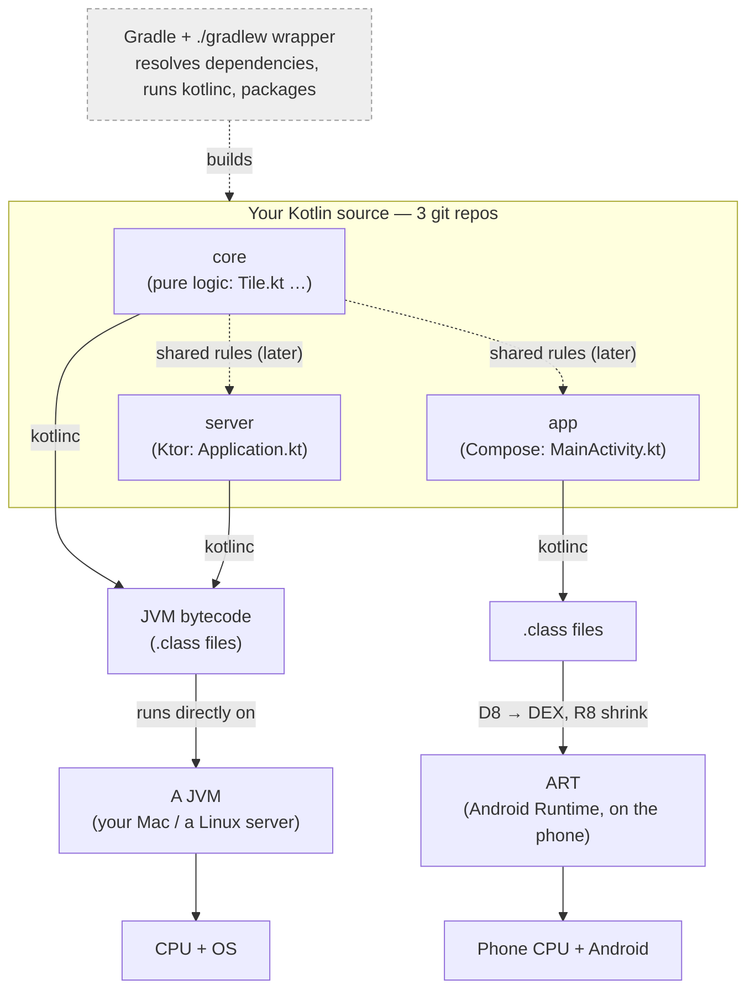

# Kotlin, from the JVM up — the course

A deep, from-scratch course that takes you from "never written Kotlin" to **reading and editing
every single line** of a real three-module app — a shared pure-Kotlin `core`, a Ktor `server`, and a
Compose `app` — and understanding the ecosystem underneath them (JVM, bytecode, coroutines, Gradle,
Ktor, Compose).

Written for Alexandro. Assumes you can already program (you know JavaScript/Node and Python), so it
does **not** waste your time on "what is a variable." It spends that time on what's actually new:
the JVM, Kotlin's type system, coroutines, lambda-with-receiver, and the build ecosystem — the
things that make the project's code look like magic until you see the machinery.

Everything here is grounded in official documentation (kotlinlang.org, ktor.io,
developer.android.com, docs.gradle.org) with links, and every code snippet is verified — either run
through the Kotlin REPL or disassembled with `javap` so you see the *real* output, not a claim.

---

## The one diagram to hold in your head

Three repos of Kotlin source. One compiler. Two runtimes (a normal JVM for core/server; Android's
ART for the app). Gradle drives all of it.



Three facts this diagram encodes — memorize these and half the confusion disappears:

1. **Kotlin is a *language*; the JVM/ART is a *runtime*.** Kotlin compiles to the same **bytecode**
   Java produces, so it inherits the entire Java ecosystem (Ktor, Netty, the Android SDK, JUnit).
2. **`core` is pure Kotlin on purpose** — no Android, no Ktor — so the *identical* logic
   bytecode can run on the server and (later) inside the app. Same source, same behavior, both sides.
3. **Gradle is the thing that turns source into runnable artifacts** and downloads every library.
   It is Kotlin's "npm + webpack + make," not a language feature.

---

## How to use this course

Read the chapters in order the first time — each builds on the last. After that, jump to whatever you
need. Every concept ties back to real, runnable code you can paste into the REPL or compile.

Keep three tools open while you read:

```bash
kotlin                       # the REPL: paste snippets, see results. Ctrl+D to quit.
kotlinc file.kt -d out.jar   # compile ahead-of-time (used when we inspect bytecode)
javap -c -p SomeClass.class  # DISASSEMBLE: show the real bytecode a construct became
```

Every snippet marked "REPL" is pasteable. Every bytecode listing in Chapter 02 was produced by
running `javap` on compiled project code — you can reproduce it yourself.

> **Jargon, defined once, up front.** *Compile* = translate your source into another form (here,
> bytecode). *Bytecode* = a compact, CPU-independent instruction set. *Runtime* = the program that
> executes your compiled code (the JVM). *Dependency* = an external library your code uses. *Gradle*
> = the build tool that compiles your code and fetches dependencies. Each is expanded in its chapter.

---

## Course map

| # | Chapter | What you walk away understanding |
|---|---------|----------------------------------|
| 00 | **This page** | The whole-stack mental model; how to run everything. |
| 01 | [The JVM & bytecode](01-jvm-and-bytecode.md) | What actually runs your code: bytecode, the JVM's memory, class loading, JIT, GC — and the Android (DEX/ART) variant. |
| 02 | [Kotlin → bytecode (all angles)](02-kotlin-to-bytecode.md) | What each Kotlin construct *becomes* (`data class`, `object`, extension fun, default args…), shown with **real `javap` output** from `Tile.class`. |
| 03 | [Language core & the type system](03-language-core.md) | `val`/`var`, `Any`/`Unit`/`Nothing`, null safety in full, scope functions, classes, `sealed`/`enum`/`data`, generics & variance. |
| 04 | [Functions, lambdas & building a DSL](04-functions-lambdas-dsl.md) | Function types, closures, `inline`/`reified`, and **lambda-with-receiver** — the one idea behind every `{ }` block in Ktor and Compose. |
| 05 | [Coroutines & Flow](05-coroutines-and-flow.md) | Suspension vs blocking, structured concurrency, `Job`/`async`, `Channel`/`Flow`/`StateFlow` — the engine under the server's WebSocket loop and under Compose. |
| 06 | [Gradle & the build ecosystem](06-gradle-and-ecosystem.md) | The build model, `implementation` vs `api`, BOM/`platform`, version catalogs, the AGP APK pipeline, Ktor's & Compose's architecture. |

> **Chapters 07–09** apply everything above to a real codebase, line by line (`Tile.kt`,
> `Application.kt`, `MainActivity.kt`). They live in a **separate private repo** because they walk an
> in-progress product — but the six public chapters teach every concept they use, so you can read
> your own code the same way.

## Suggested pace

- **Sitting 1 (foundations):** 00 → 01 → 02. You'll understand *what runs* and *what your Kotlin
  turns into*. This is the "all angles" foundation.
- **Sitting 2 (the language):** 03 → 04. After this you can read most Kotlin anywhere.
- **Sitting 3 (concurrency + build):** 05 → 06. The two systems that make the project tick.
- **Then apply it to your own code** — open any `.kt` file, point at any line, and name what it does.

When you finish, you should be able to open any `.kt` file, point at any line, and say what it does
*and* roughly what it compiles to. That's the goal.

---

*Grounded in: [kotlinlang.org/docs](https://kotlinlang.org/docs/home.html),
[ktor.io/docs](https://ktor.io/docs/welcome.html),
[developer.android.com](https://developer.android.com/develop/ui/compose/documentation),
[docs.gradle.org](https://docs.gradle.org/current/userguide/userguide.html). Secondary reference:
*Kotlin in Action, 2nd ed.* (Manning) and the [Kotlin language specification](https://kotlinlang.org/spec/).*
